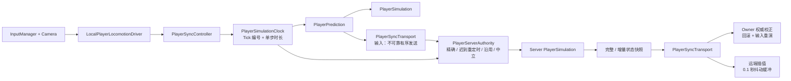

# 玩家同步链路详解

## 术语与核心代码名

本文在术语首次出现时给出中文解释，后续沿用英文简称。

| 术语 | 含义 |
|---|---|
| Server Authority（服务器权威） | Server 校验输入并决定最终玩家状态 |
| Owner Prediction（拥有者本地预测） | Owner 不等待网络返回，立即按本地输入模拟自己 |
| Reconcile（权威校正） | 比较同 Tick 的预测状态和 Server 状态，并在必要时回滚 |
| Rollback / Replay（回滚 / 重演） | 恢复旧权威状态，再执行尚未确认的本地输入 |
| Hard Resync（硬同步） | 历史不足或 Server 领先时，直接跳到权威状态 |
| Remote Observer（远端观察者） | 观看其他玩家，只缓冲和表现 Server 快照的 Client |
| Tick（固定模拟步） | 固定频率推进的一次模拟序号 |
| Snapshot（状态快照） | Server 在某个 Tick 产生并下发的玩家状态 |
| Full / Delta Snapshot（完整 / 增量快照） | Full 可独立还原；Delta 只保存相对基准快照的变化 |
| Baseline（基准快照） | 解码 Delta 所依赖的 Full Snapshot |
| Exact（精确输入） | 原始输入 Tick 与下一 Server Tick 完全匹配 |
| RetimedLate（迟到重定时输入） | 安全窗口内的最新迟到输入，被映射到下一权威 Tick |
| ReusedPrevious / Hold（沿用上一输入） | 短时缺包时有限次数继续使用上一输入 |
| Neutral（中立输入） | 不移动、不瞄准、不冲刺的安全输入 |
| Ring Buffer（环形缓冲） | 用固定容量按 Tick 保存历史，满后循环覆盖最旧槽位 |
| ReliableSequenced（可靠有序） | 保证最终到达并保持同管线消息顺序 |
| UnreliableSequenced（不可靠有序） | 不重传丢包，只保留同管线较新的有序消息 |
| Pipeline（传输管线） | 消息的可靠性、顺序性和发送通道组合 |
| Jitter Buffer（抖动缓冲） | 故意落后最新状态一小段时间，用历史快照吸收网络抖动 |
| Warp（强制传送） | 复活、换层或服务器强制改变玩家位置的同步重置事件 |
| NGO（Netcode for GameObjects） | Unity 的网络对象、连接、所有权和 Tick 框架 |
| NetworkObject（网络对象） | 由 NGO 管理、具有唯一网络编号和 Owner 的对象 |
| Spawn / Despawn（网络生成 / 销毁） | 让网络对象在各端出现或移除的生命周期操作 |
| Named Message（具名消息） | 通过字符串名称注册和路由的 NGO 自定义消息 |
| DirtyMask（变化位掩码） | 用每个二进制位标记本快照哪些字段发生变化 |
| Budget（发送额度） | 每 Tick 累加、达到阈值后触发一次发送的整数调度值 |
| GC（垃圾回收分配） | 运行时产生的托管内存分配，过高可能带来回收卡顿 |
| AOI（关注区域） | 只向 Client 同步其附近或相关对象的 Interest Management 策略 |
| P0 / P1 / P2 | 最高优先级 / 较高优先级 / 后续优化级别 |
| Baseline / Typical / Adverse | 无弱网基准档 / 常见弱网档 / 压力弱网档 |

主要代码名及作用：

| 代码名 | 作用 |
|---|---|
| `PlayerInputCommand` | 一条带 Tick 的移动、瞄准和按钮输入结构体 |
| `PlayerSimulationState` | 可完整恢复位置、速度、控制状态和体力的状态结构体 |
| `PlayerSnapshotPacket` | 表示 Full 或 Delta Snapshot 的网络数据结构体 |
| `InputManager` | 从键盘、鼠标或手柄读取当前玩法输入的统一入口 |
| `LocalPlayerLocomotionDriver` | 把本地设备输入和相机方向转换为同步输入的上游组件 |
| `PlayerLocomotionInput` | 移动控制器实际消费的移动、瞄准和冲刺意图结构体 |
| `IPlayerCharacterBody` | 隔离纯 C# 运动逻辑与 Unity `Transform`、`CharacterController` 的身体访问接口 |
| `CharacterControllerPlayerBody` | `IPlayerCharacterBody` 的 Unity 适配器，负责真正读取姿态、移动和传送 |
| `PlayerLocomotionController` | 根据移动意图推进运动、控制状态和体力的纯 C# 类 |
| `PlayerMotor` | 保存速度等底层运行状态并通过身体接口执行位移的纯 C# 类 |
| `PlayerSyncConfig` | 集中保存 Tick、容错、校正、发送和插值参数 |
| `PlayerSimulationClock` | 由 Controller 持有的纯 C# 固定步时钟，保存当前 Tick 并计算单步时长 |
| `PlayerSimulation` | Owner Prediction 和 Server Authority 共用的模拟、捕获、恢复入口 |
| `PlayerPrediction` | 保存输入/状态历史，并负责本地预测、校正和重演 |
| `PlayerServerAuthority` | Server 侧接收输入、选择本 Tick 输入并执行权威模拟 |
| `PlayerRemoteInterpolation` | Observer 侧保存快照并计算远端表现状态 |
| `PlayerSyncTransport` | 注册网络消息、序列化并按 NetworkObjectId 路由输入和快照 |
| `PlayerSyncController` | 按当前网络身份组装上述模块并驱动每个网络 Tick |
| `GameNetworkRuntime` | 在 Gameplay 启动/退出时创建和销毁同步传输服务 |
| `GameNetworkRuntime.PlayerSync` | 供玩家端点取得当前全局 `PlayerSyncTransport` 的静态入口 |
| `PlayerSpawnController` | 负责生成或重新放置玩家，并在传送后调用同步重置 |
| `TickMath` | 提供 `uint` Tick 回绕安全的新旧比较和距离计算 |

## 总体架构

当前系统是 Server Authority（服务器权威）、Owner Prediction（拥有者本地预测回滚）、Remote Observer（远端观察者）缓冲插值的固定 Tick（固定模拟步）同步架构。



核心原则是 Owner Prediction 与 Server Authority 共用 `PlayerSimulation.Simulate`（用一条输入推进一次玩家模拟的方法）。输入设备、网络协议、历史缓存、回滚策略和视觉插值分别放在不同层中。

### 纯 C# 模拟栈与持有关系

当前 Player Prefab（玩家预制体）不再分别挂载 `PlayerMotor`、`PlayerLocomotionController`、`PlayerSimulation`。三者都是普通 C# 对象，由 `PlayerSyncController.Awake`（总控组件创建运行时依赖的方法）按下列顺序构造并单向持有：

```text
PlayerSyncController（Unity/NGO 最上层组件）
  ├─ PlayerSimulationClock（纯 C# 固定步时钟）
  -> PlayerSimulation（统一模拟、捕获、恢复门面）
      -> PlayerLocomotionController（玩法运动、控制状态、体力）
          -> PlayerMotor（速度、转向和位移积分）
              -> IPlayerCharacterBody
                  -> CharacterControllerPlayerBody（Unity 身体适配器）
                      -> Transform + CharacterController
```

`PlayerSyncController` 同时持有 `PlayerMovementConfig`（移动参数结构体）和 `PlayerStaminaConfig`（体力参数结构体）的序列化配置。这样场景只需要挂一个同步总控脚本，底层对象不会参与 Unity 组件查找和独立生命周期；`CharacterController` 仍是 Unity 原生组件，因为碰撞移动必须作用于场景对象。

时钟模块同样由 `PlayerSyncController` 创建和持有。当前 NGO `NetworkTickSystem.Tick`（网络固定步事件）只提供一次“向前推进”的驱动信号；Tick（固定模拟步）编号和 `TickDeltaTime`（单步秒数）由 `PlayerSimulationClock` 计算。输入/快照发送额度、预测、权威和插值算法没有改变。

## 启动与生命周期

### Gameplay 网络运行时

`GameNetworkRuntime`（Gameplay 网络服务生命周期入口）要求 NGO（Netcode for GameObjects）已经处于 Listening（开始监听连接）状态，然后：

1. 初始化 Gameplay NetEventBus；
2. 创建 `PlayerSyncTransport`；
3. 注册输入和快照 Named Message Handler（具名自定义消息处理器）；
4. 在 Gameplay 退出时反注册并清空静态 `PlayerSync`。

因此 Player NetworkObject（由 NGO 管理、带网络身份的玩家对象）必须在 `GameNetworkRuntime.InitializeAsync`（异步初始化 Gameplay 网络服务的方法）完成之后 Spawn（网络生成），否则 `PlayerSyncController.OnNetworkSpawn`（玩家网络对象生成后的同步初始化回调）会因为 Transport（传输服务）未初始化而退出。

### 单玩家同步端点

`PlayerSyncController.Awake` 先创建所有身份共用的纯 C# 模拟栈与时钟；`OnNetworkSpawn` 用 LocalTime/ServerTime（本地/服务器网络时间）设置初始 Tick，再根据身份创建不同网络中层对象：

| 身份 | 创建内容 | Tick 行为 |
|---|---|---|
| Remote Client Owner（远端客户端拥有者） | `PlayerPrediction` | 本地预测、输入发送、权威校正 |
| Server（服务器）上的任意玩家 | `PlayerServerAuthority` | 权威输入解析、固定 Tick 模拟、快照发送 |
| Remote Observer（远端观察者） | `PlayerRemoteInterpolation` | 不模拟输入，只缓冲并表现快照 |
| Host Owner（主机本地拥有者） | 只用 Server Authority | 避免同一 `PlayerSimulation` 重复跑 Prediction（预测） |

Controller 使用 `NetworkObjectId`（网络对象唯一编号）注册到 Transport；Server 额外保存 `OwnerClientId`（该对象所属客户端编号），用于阻止 Client 操作不属于自己的玩家。

## 输入链路

### 设备输入到同步层

`LocalPlayerLocomotionDriver.Update`（每渲染帧采集本地移动输入的方法）只在 `IsOwner`（本机拥有该网络对象）时工作：

1. 从 `InputManager` 读取 Move、Aim、Sprint；
2. 通过 Camera 把屏幕/局部输入转换为世界平面方向；
3. 生成不带 Tick 的 `PlayerInputCommand`；
4. 调用 `PlayerSyncController.SubmitLocalInput`（把最新输入事实交给同步层的方法）。

Controller 只保存“最新输入事实”。网络 Tick 到来时由 `PlayerSimulationClock` 分配 Tick，再交给 Prediction，避免渲染帧率决定模拟序号。

### Owner Prediction（拥有者本地预测）

当前 NGO TickRate 与 `PlayerSimulationClock.TickRate` 默认都是 30 Hz。

每个 Tick：

1. `PlayerSyncController.HandleNetworkTick`（接收当前固定步驱动的方法）调用 `PlayerSimulationClock.AdvanceOneTick`（推进并返回下一个 Tick 的方法）；
2. `PlayerPrediction.Predict`（消费时钟 Tick、执行本地模拟并写入历史的方法）把该 Tick 写入输入；
3. 把输入存入 1024 Tick 的 Input Ring Buffer（输入环形历史缓冲）；
4. 使用时钟的 `TickDeltaTime` 调用共享 `PlayerSimulation.Simulate`；
5. 把预测状态存入 State Ring Buffer；
6. 根据发送策略决定是否发包。

发送策略：

- 活跃输入目标 30 包/秒；
- Aim、Sprint、是否移动或方向变化超过 0.1 时立即发送；
- 静止时每 1 秒发送中立心跳；
- 每包最多携带当前输入和前两 Tick 输入，共 3 份冗余；
- 批内按旧到新写入，使用 `UnreliableSequenced`。

历史冗余负责抗丢包；它不再承担高延迟补救，高延迟由 Server 的受限 RetimedLate 处理。

## Server Authority（服务器权威）

### Transport（传输层）验证

Server 收到 `PG.PlayerSync.Input`（玩家输入 Named Message 的协议名称）后依次验证：

1. 冗余 Count 必须是 1 到 3；
2. `NetworkObjectId` 必须存在；
3. 消息发送者必须等于端点的 `OwnerClientId`；
4. 解析失败只记录 Warning，不进入模拟。

### 输入净化与时间边界

`PlayerInputCommand.TrySanitize`（检查输入有限值并输出安全输入副本的方法）：

- 拒绝 NaN/Infinity；
- WorldMove Clamp 到长度 1；
- AimDirection 归一化；
- Button 只保留 AimHeld 和 SprintHeld。

`PlayerServerAuthority.PushInput`（Server 接收并按时间分类一条 Client 输入的方法）还限制：

- 未来输入最多领先 128 Tick；
- 迟到输入默认最多允许 12 Tick 的安全重定时；
- RetimedLate 必须是客户端 Tick 单调更新的最新输入；
- 环形缓冲内重复 Tick 和旧冗余不能覆盖更新输入。

### 每 Tick 的输入解析优先级

权威模拟下一 Tick 时按以下顺序解析：

1. `Exact`（精确匹配输入）：Buffer 中存在与下一 Server Tick 完全一致的输入；
2. `RetimedLate`（迟到重定时输入）：没有 Exact，但存在窗口内、单调更新的最新迟到输入，将它重标为下一 Server Tick；
3. `ReusedPrevious`（沿用上一输入）：短时丢包时沿用上一解析输入，最多 3 Tick；
4. `Neutral`（中立输入）：超过沿用上限后回到不移动、不瞄准、不冲刺，防止卡键无限持续。

Exact 会丢弃比它更旧的 Pending RetimedLate。RetimedLate 不是放宽全部旧输入，而是一个有时间窗、单调序号和 Next-Tick 消费约束的补救路径。

## 统一模拟

`PlayerSimulation` 是预测和权威共用入口：

- `Simulate`：把网络输入转换为 `PlayerLocomotionInput`，调用 `PlayerLocomotionController.Simulate`；
- `CaptureState`：经由 Locomotion 捕获 Motor（运动器）、ControlState（控制状态）和 StaminaState（体力状态）的完整可恢复状态；
- `RestoreState`：经由 Locomotion 恢复位置、旋转、速度、角速度、控制状态和体力状态；
- `Warp`：通过 Motor 和身体适配器完成强制传送；
- `ResetRuntimeState`：清理 Locomotion 与 Motor 的运行状态，但不负责清理网络历史。

该共享入口减少了两套移动逻辑导致的确定性偏差。纯 C# 化改善的是依赖方向和可测试性，不会让 Unity `CharacterController` 变成确定性物理；不同端的碰撞执行仍可能产生小误差，因此系统继续保留回滚。

## Owner Reconcile（拥有者权威校正）

Client Owner 收到权威 `PlayerSimulationState`（可完整恢复玩家运动与玩法状态的结构体）后：

1. 忽略不比 LastConfirmedTick 新的快照；
2. 如果 Server Tick 超过 CurrentTick，执行 Hard Resync（无法普通回滚时直接跳到权威状态）；
3. 如果同 Tick 预测历史还不存在但差距仍小于 HistoryCapacity，认为是刚 Spawn 时 Server 尚未追上本地起点，暂不倒退；
4. 找到同 Tick 预测状态后计算位置、旋转、速度和体力误差；
5. 超过阈值或离散状态不一致时，Restore（恢复）权威状态，并 Replay（重演）未确认输入直到 CurrentTick。

默认回滚阈值：

| 状态 | 阈值 |
|---|---:|
| 位置 | 0.08 m |
| 旋转 | 2° |
| 速度 | 0.25 |
| 体力 | 0.5 |

Adverse 实测出现 2 次 Hard Resync，说明极端弱网下仍存在 Server Tick 短时超过 Owner Prediction 或预测历史不可用的窗口。

## Snapshot（状态快照）协议

Server 以整数 Budget（按 Tick 累加的发送额度）把 30 Hz 模拟降采样为 20 Hz 快照。

### Full Snapshot（完整快照）与 Delta Snapshot（增量快照）

- 第一个快照为 Full；
- 后续最多 9 个 Delta 共用这个固定 Full Baseline；
- 第 10 个重新发送 Full，因此理想情况下约每 0.5 秒一个关键帧；
- Full 使用 `ReliableSequenced`；
- Delta 使用 `UnreliableSequenced`；
- DirtyMask（变化字段位掩码）可独立选择 Position（位置）、Rotation（旋转）、Velocity（速度）、AngularSpeed（角速度）、ControlState（控制状态）、StaminaState（体力状态）。

同一玩家、同一 Server Tick 的 Snapshot 只构建一次，再发送给所有非 Server Client。

### 当前 Baseline（基准快照）风险

Client 只在持有相同 `BaselineTick`（本 Delta 所依赖完整快照的 Tick）的 Full 时解析 Delta。Full 与 Delta 使用不同 Pipeline（传输管线），可能跨管线重排；Full 丢失、迟到或 Baseline 已切换时，Delta 会被丢弃。

本轮测得：

- Baseline：0 次；
- Typical：28 次；
- Adverse：88 次。

这是当前快照链路最明确的下一优化点。

## Remote Observer（远端观察者）插值

Remote Observer 不运行玩家输入模拟。收到完整状态后进入 32 元素顺序缓冲：

- 默认表现时间落后最新权威时间 0.1 秒，即约 3 Tick；
- 每帧推进 Render Offset（表现时间相对最新权威 Tick 的偏移），在相邻 Snapshot 之间插值 Position、Rotation、Velocity、AngularSpeed、Stamina；
- ControlState 选择较近端状态；
- 快照 Tick 必须单调递增；
- 相邻位置相差超过 5 m 视为传送，清空旧历史；
- Buffer 耗尽时停在 Oldest/Latest，没有外推。

固定 0.1 秒延迟对 Typical 尚可，但 Adverse 的 60 ms 抖动、500 ms UTP RTT 估算下偏小，容易更频繁抵达缓冲边界。

## Warp（强制传送）、换层与复活

`PlayerSpawnController.RepositionPlayers`（统一重新放置玩家的方法）优先调用 `PlayerSyncController.ResetAfterWarp`（传送后重置模拟和全部同步历史的方法）。该方法会：

1. 按 ServerTime 捕获 Tick；
2. 写入新位置和旋转并清零速度；
3. 恢复 Simulation；
4. 清空 Prediction、Authority、Interpolation 历史；
5. 重置最新输入、Snapshot Baseline 和发送 Budget。

这能避免传送前历史在新位置上继续 Replay 或插值。

## 默认配置总表

| 配置 | 默认值 |
|---|---:|
| Simulation TickRate（模拟频率） | 30 Hz |
| History Capacity（历史容量） | 1024 Tick |
| Max Input Hold（最大输入沿用） | 3 Tick |
| Max Future Input（最大未来输入） | 128 Tick |
| Max Late Input Retiming（最大迟到重定时） | 12 Tick |
| Snapshot Send Rate（快照发送频率） | 20 Hz |
| Input Redundancy（输入冗余份数） | 3 |
| Active Input Send Rate（活跃输入发送频率） | 30 Hz |
| Idle Heartbeat（空闲心跳） | 1 s |
| Immediate Direction Threshold（方向立即发送阈值） | 0.1 |
| Remote Interpolation Delay（远端插值延迟） | 0.1 s / 3 Tick |
| Remote Snapshot Buffer（远端快照缓冲容量） | 32 |
| Teleport Distance（传送判定距离） | 5 m |
| Max Delta Between Full（完整快照之间最大增量数） | 9 |

当前主循环仍订阅 `NetworkManager.NetworkTickSystem.Tick`（NGO 网络 Tick 事件），但它只负责触发 `PlayerSimulationClock.AdvanceOneTick`。时钟类当前只实现 `TickRate`、`TickDeltaTime`、`CurrentTick`、`Reset`（重新对齐）和 `AdvanceOneTick`，刻意不加入独立累加器、Catch-up（卡顿后追帧）或 Drift Correction（时钟漂移校正）。这些属于二轮重构。

`_snapshotSendRate`、`_inputSendRate` 仍使用当前 Tick 上的整数 Budget（发送额度）或间隔判断；因此本轮不改变 30 Hz 模拟、20 Hz 快照和 30 Hz 活跃输入语义。

## 优化优先级

### P0（最高优先级）：减少 Adverse（压力弱网）下 Hard Resync（硬同步）

当前压力档 20 秒出现 2 次 Hard Resync。建议先增加原因分类指标：

- Server Tick Ahead（权威 Tick 领先本地预测）；
- State History Missing（缺少同 Tick 预测状态历史）；
- Replay Input Missing（缺少校正后需要重演的输入历史）。

对于只领先 1 到 2 Tick 的 Server Snapshot，可评估短暂等待下一本地 Tick、受限 Catch-up Simulation，或在不清空全部历史的情况下前推；不能直接把所有 Ahead Snapshot 都忽略，否则会掩盖时钟漂移。

### P0（最高优先级）：重做 Delta Baseline（增量基准快照）确认

建议选一种可验证方案：

1. 每 Client 维护已确认 Baseline，只有收到 Ack（客户端确认已持有基准）后才发送对应 Delta；
2. Full/Delta 走同一有序 Pipeline；
3. Delta 缺 Baseline 时由 Client 请求 Full；
4. 弱网下降低 `MaxDeltaSnapshotsBetweenKeyframes`（两个完整关键帧之间允许的最大增量快照数），作为短期缓解。

当前 Baseline 是“每玩家共享、Server 侧不感知 Client 是否拥有”的固定关键帧，扩展到多 Client 后问题会更明显。

### P1（较高优先级）：自适应 Observer Jitter Buffer（观察者抖动缓冲）

基于 Snapshot 到达间隔的 P95/P99 动态调整插值延迟，并增加短距离、短时间的受限外推。需要设置上限，避免把网络问题转化为过高视觉延迟。

### P1（较高优先级）：完善 RetimedLate（迟到重定时）遥测和策略

建议增加：迟到 Tick 年龄直方图、Pending 被替换次数、Retimed 后按钮切换延迟、每 Client 当前输入年龄。用实际分布调整默认 12 Tick，而不是长期固定。

### P1（较高优先级）：序列化与 GC（垃圾回收分配）

Transport 每次消息都创建 `FastBufferWriter(Allocator.Temp)`（使用临时内存分配的网络序列化写入器）。两玩家当前性能稳定，但多人时可考虑：

- 批量发送多个玩家快照；
- 复用/池化发送缓冲；
- 位置、旋转、速度量化；
- AOI/Interest Management（关注区域管理），避免给所有 Client 广播所有玩家。

### P2（后续优化）：Tick 配置单一来源

Controller 目前用 `PlayerSyncConfig.SimulationTickRate` 构造纯 C# 时钟，并在 NGO TickRate 不一致时 Warning（警告）。二轮重构若改用独立累加器，应再决定是否取消这项一致性约束；当前外部驱动模式仍必须保持一致。

### P2（后续优化）：物理确定性边界

Owner 与 Server 共用 CharacterController 模拟，但真实关卡碰撞、动态障碍物和浮点差异仍可能增加回滚。应补充带坡面、台阶、移动障碍和多人碰撞的场景测试。

## 当前可用性判断

- 启动、端点注册、输入上行、权威模拟、快照下行、Owner Reconcile 和 Observer Interpolation 已全部实测跑通。
- 纯 C# 改造后的无弱网回归运行 12.01 秒：Host、Client 均通过；Client 发送 324 个输入包，Owner/Observer 各接收 245 个快照，Hard Resync 为 0。
- Player Prefab 当前只挂载 `PlayerSyncController` 作为同步模拟总控；Motor、Locomotion、Simulation 均由它在内存中构造。
- 时钟模块接入后的四次 12 秒无弱网样本都完成双玩家、输入、快照、Owner 校正和 Observer 插值；Host 均通过。Client 分别出现 3、4、1、2 次 Hard Resync，未通过“必须为 0”的严格门槛。该现象说明当前依赖两个 Editor 各自 NGO Tick 驱动时仍存在短时前后关系，二轮重构应增加 Hard Resync 原因分类和独立时钟追帧/校正，而不能把本轮基础时钟类描述为已经解决漂移。
- Baseline 和 Typical 达到本轮严格门槛。
- Adverse 仍可持续工作，但因 2 次 Hard Resync 不应宣称稳定通过。
- 下一轮应优先解决 Snapshot Baseline 和 Hard Resync 原因分类，再扩大玩家数量与真实关卡测试。
