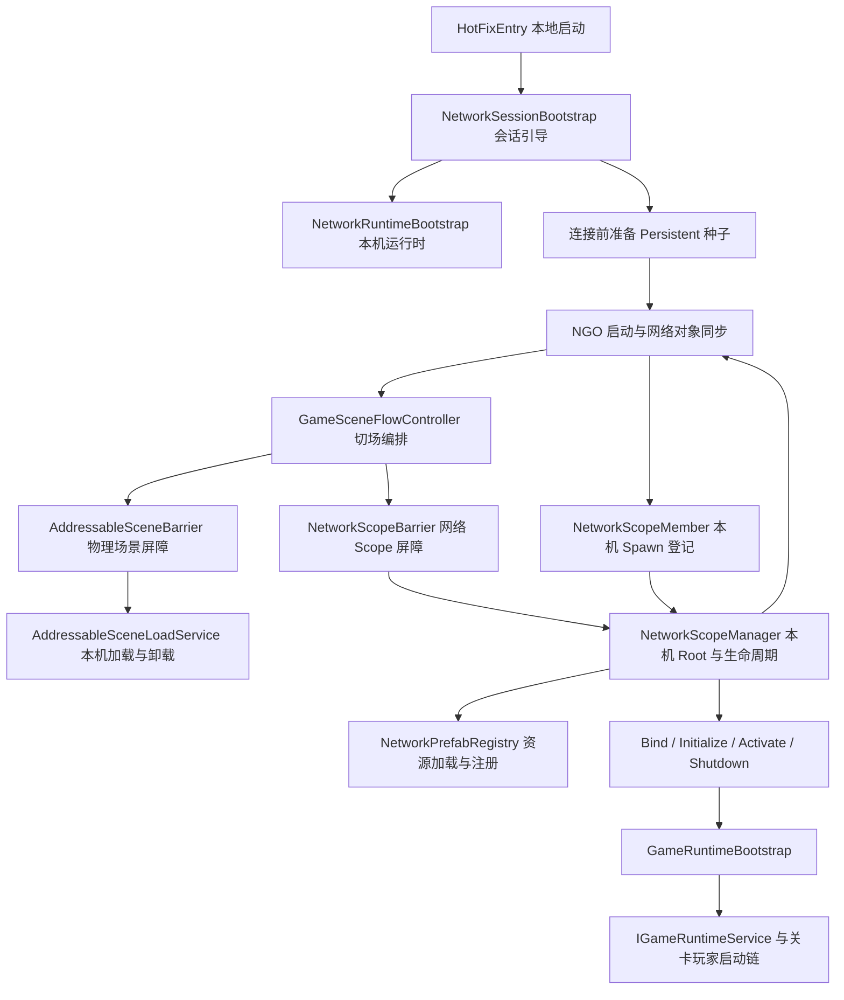
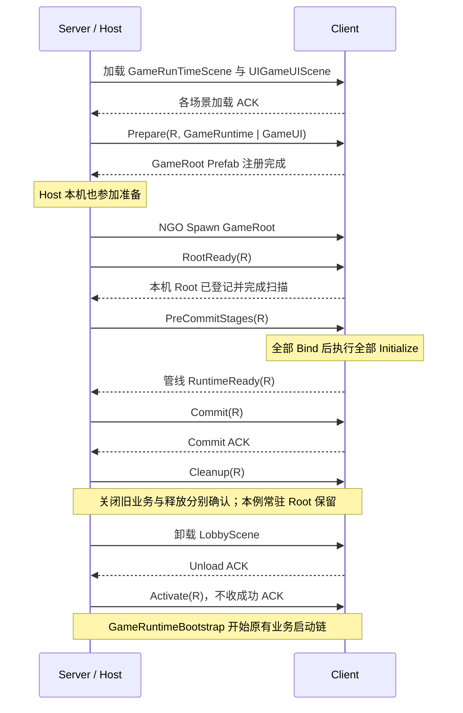

# Addressable 场景架构管线详解

本文依据 2026-09-05 的当前代码与生产资源整理。重点说明架构为什么演变成现在这样、各层实际承担什么职责，以及已经具备的能力和仍需补齐的部分。演进背景按本项目的设计过程说明，不把旧方案描述为当前仍在执行的代码。

当前架构的核心选择是：**物理场景交给 Addressables，网络对象的生成与状态复制交给 NGO，跨端准备和业务启动顺序交给 SceneFlow。** 为此，原本摆在场景中的 GameRoot 被提取成独立网络 Prefab；场景加载完成与 Gameplay 可以启动被拆成不同的条件。

本文适合先理解设计，再阅读源码。具体组件接入步骤见同目录 [网络组件接入说明](网络组件接入Addressable场景加载说明.md)，阶段契约速查见 [PIPELINE.md](PIPELINE.md)。

## 1. 前因后果：为什么从复用场景物体走到当前架构

### 1.1 最初想解决的是“场景里已经有了，为什么还要再生成”

早期场景已经摆好了网络物体，组件之间的 Inspector 引用、层级和位置也已经配置完毕。使用 Addressables 加载场景后，这些 GameObject 就在本机存在了。此时最直观的想法是：让 NGO 使用眼前这个对象，省掉再生成一份 Prefab，也尽量保留已有场景结构。

于是，最初的路线是干涉 NGO 实例化流程：当网络侧需要生成某个对象时，尝试把已经随场景加载出来的对象交给它，强行复用场景网络物体。用通俗的话说，就是“房间和家具都已经摆好了，让网络系统认领这些现成家具”。

这条路线的吸引力很实际：初期迁移量小，场景编辑方便，原有引用不容易丢，也容易先跑通 Host 上的正常流程。

### 1.2 后来发现，“找到一个现成对象”只解决了一小部分问题

两台机器各自加载出名字、层级相同的物体，并不等于它们已经被网络系统识别为同一个网络实体。后续还要回答很多问题：

- Server 发出 Spawn 时，Client 的 Addressables 场景是否已经加载完成？如果没有，消息和对象如何等待、配对？
- 场景里的实例、Prefab 身份和本次会话的 NetworkObjectId 如何保持一致？场景重载后如何避免绑定到旧实例？
- 已经存在的对象什么时候算完成 NGO Spawn，什么时候可以访问其他网络对象，什么时候可以运行 Gameplay？
- 场景卸载、网络 Despawn、对象池回收和 Addressables Release，究竟谁先执行、谁拥有对象？
- 晚加入、断线重连、半途加载失败时，新端如何补齐场景和网络状态？

原先希望复用的只是“实例”，实际逐渐接管的却是一整套“对象在什么时机存在、如何同步、如何销毁”的规则。缺少原生场景同步流程替自己兜住这些状态后，每多一种异常情况，往往就要再补一段自定义配对或补偿逻辑。

这里的“缺少 NGO 同步”需要准确理解：**自定义实例化 Handler 本身并不会天然禁用 RPC 或 NetworkVariable。** 困难在于，手动加载场景、认领已有对象和 NGO 原生场景对象生命周期不再天然处于同一条流程中；原生场景管理提供的配套协调不能直接照搬。对象能显示出来，不能证明后续联机生命周期已经完整。

### 1.3 转折点：把网络物体从物理场景中拆出来

最终采用的路线是承认两件事各有自己的生命周期：

1. **物理场景**提供环境、灯光、非网络场景对象、UI 等内容，按 Addressables 地址加载和卸载。
2. **网络 Root**做成独立 Prefab，各端先加载并注册，随后由 Server 发起 NGO Spawn，Client 按已注册 Prefab 接收生成。

GameRoot 因此从 GameRunTimeScene 中提取出来，内部层级、单个根 NetworkObject、子服务引用和启动顺序继续保留。各端不再普遍寻找“场景里恰好对应的那个实例”，而是围绕 NGO 已经生成的网络 Root 工作。

换回前面的比喻：Addressables 负责准备房间；网络系统按统一清单安排需要同步的家具；SceneFlow 确认大家的房间、家具和准备工作都到位后，再允许开始游戏。

### 1.4 “归还 NGO 同步能力”具体归还了什么

当前 Addressables 后端在 `NetworkRuntimeBootstrap.ConfigureSceneBackend` 中设置 `EnableSceneManagement = false`、`ForceSamePrefabs = false`。因此，这次调整**没有重新启用 NGO 的集成场景管理**。

| 能力 | 当前负责人 | 这项选择的含义 |
| --- | --- | --- |
| Addressable 物理场景加载、卸载、Handle 生命周期 | Addressables + 本机场景服务 | 场景内容继续走项目的资源加载方式 |
| 网络 Root 的 Spawn / Despawn、NetworkObjectId、Ownership、NetworkVariable / RPC 复制 | NGO | 使用正常网络对象生命周期，减少自行配对场景实例的负担 |
| Spawn 前让各端具备目标 Prefab | Registry + Prepare 屏障 | 动态资源不能假设已经在所有 Client 注册 |
| 所有端是否完成场景加载、Root 登记、准备与清理 | 两类 Barrier | 自定义场景管线必须继续承担这部分协调 |
| 子服务、地图、玩家何时初始化完成 | Gameplay 自身 | NGO 不知道“角色和武器都准备好”这样的业务条件 |
| 游戏中途加入者的场景、会话、地图状态补齐 | 尚未形成完整流程 | 不能因为对象复制交回 NGO，就宣称晚加入已经解决 |

`ForceSamePrefabs = false` 允许按需动态注册 Prefab，不代表不同客户端可以任意使用不同版本的 Prefab。真正开始 Spawn 前，各端仍必须具备兼容的资源与网络组件结构。

### 1.5 为什么现在仍有一个种子 Handler

当前 Registry 中仍有 `PersistentSeedHandler`，只用于 `NetworkSessionRoot`。这是范围明确的引导例外：负责发 RPC 的屏障不能等自己发 RPC 才被创建。连接前审批由 NetworkBootstrap 上的本地 `LobbyConnectionGate` 负责，LobbyNetworkRoot 只在 Lobby Scope 内生成。

各端连接前从同一个网络 Prefab 创建种子，Client 后续收到 NGO Spawn 时复用这一个种子；它仍由 NGO 完成网络 Spawn 和同步。这里复用的是**预先准备好的会话 Prefab 实例**，没有恢复“任意场景网络物体都靠人工认领”的通用方案。动态玩家对象的池化 Handler 同样属于其自己的实例管理职责。

当前架构保留必要的实例化扩展，但收窄了扩展的对象范围和生命周期，让大部分网络 Root 回到标准生成路径。

## 2. 先分清四个容易混在一起的概念

| 概念 | 含义 | 当前例子 |
| --- | --- | --- |
| Physical Scene | Unity 实际加载的 `.unity` 场景，有自己的加载 Handle | LobbyScene、GameRunTimeScene、UIGameUIScene |
| Scope / SceneMask | 当前业务需要哪些网络 Root 的逻辑集合 | Lobby；GameRuntime 与 GameUI 的组合 |
| Network Root | Catalog 中有稳定身份、由一个根 NetworkObject 管理的网络 Prefab 实例 | GameRuntimeNetworkRoot 对应 GameRoot.prefab |
| Gameplay Ready | 服务、地图或玩家达到某项业务条件 | RuntimeReady、PlayerRuntimeReady、GamePlaying |

`NetworkPrefabEntry.IsRequiredBy` 按 SceneMask 的位交集选取 Root。当前标志位为 Lobby = 1、GameRuntime = 2、GameUI = 4；一个 Scope 可以同时包含多个物理场景，物理场景与 Root 并非一对一关系。

例如，进入游戏时加载 GameRunTimeScene 和 UIGameUIScene，目标 Mask 为 6；GameRoot 的 Mask 为 2，NetworkSessionRoot 的 Mask 为 7，因此二者属于目标集合，LobbyNetworkRoot 的 Mask 为 1 并在 Cleanup 中退出。

当前让 Unity Scene 归属与业务生命周期保持一致：Persistent Root 进入 DDOL；SceneScoped Root 必须配置 OwnerSceneName，并在 Spawn 登记时迁入已加载的目标场景。GameRoot 和 Player 属于 GameRunTimeScene，LobbyNetworkRoot 属于 LobbyScene。

## 3. 管线总览与职责边界



这条管线有三个相互衔接的控制范围：SceneFlow 决定切场步骤；Network.Runtime 管理本机 Root 与资源；Gameplay 决定关卡如何启动。Barrier 负责把本机动作协调到各端，不直接接管业务服务或资源 Handle。

### 3.1 引导、场景与网络协调脚本

下表路径相对于本文所在目录；点击脚本可直接阅读实现。

| 脚本 | 主要职责 | 边界 |
| --- | --- | --- |
| [NetworkSessionBootstrap](Runtime/NetworkSessionBootstrap.cs) | 加载本地 NetworkBootstrap；连接前准备种子；Server 启动后 Spawn 种子并进入初始 Lobby | 解决屏障自身的引导；常规切场仍调用 Controller |
| [NetworkRuntimeBootstrap](../Network.Runtime/NetworkRuntimeBootstrap.cs) | 配置后端，创建 Registry 与 ScopeManager，网络关闭后重置本机 Scope | 本地 MonoBehaviour，不参与网络 ACK |
| [GameSceneFlowController](GameSceneFlowController.cs) | Server 权威编排、固定切场计划、Commit 边界、回滚和回大厅 | 不亲自扫描业务组件或持有 Prefab Handle |
| [SceneTransitionPlan](Runtime/SceneTransitionPlan.cs) | 描述来源 / 目标 Mask、提示文案、待加载和卸载场景 | 数据描述，不执行阶段 |
| [SceneFlowBackendRouter](Runtime/SceneFlowBackendRouter.cs) | 按后端选择 Addressables Barrier 或 NGO 场景服务 | 只路由物理场景操作 |
| [AddressableSceneBarrier](Network/AddressableSceneBarrier.cs) | 发出场景 Load / Unload RPC，汇总各端成功、失败与超时 | 不负责网络 Root 的生成 |
| [AddressableSceneLoadService](Runtime/AddressableSceneLoadService.cs) | 本机场景加载、卸载及 Handle 管理 | 不管理 NGO 对象和业务就绪 |
| [NgoSceneLoadService](Runtime/NgoSceneLoadService.cs) | NGO 集成场景模式下的 Load / Unload 包装，等待场景完成事件 | 当前 Addressables 主路径不经过它 |
| [NetworkScopeBarrier](Network/NetworkScopeBarrier.cs) | Scope 阶段 RPC、Revision / Phase 检查、ACK、Activate 失败上报 | 本机动作委托 ScopeManager |
| [NetworkBarrierState](Network/NetworkBarrierState.cs) | 记录当前阶段等待谁、谁失败、截止时间 | Phase 检查由外层 Barrier 完成 |
| [SceneFlowLocalOperation](Runtime/SceneFlowLocalOperation.cs) | 本地操作串行、超时取消、等待旧任务退出 | 无法强行终止不合作的业务代码 |
| [SceneFlowLobbyRecovery](Runtime/SceneFlowLobbyRecovery.cs) | 网络控制器销毁后仍可尝试结束会话并本地返回大厅 | 最终兜底，不递归重建失败会话 |

### 3.2 Root、资源与业务脚本

| 脚本 | 主要职责 | 边界 |
| --- | --- | --- |
| [NetworkPrefabCatalog](../Network.Runtime/Definition/NetworkPrefabCatalog.cs) / [Entry](../Network.Runtime/Definition/NetworkPrefabEntry.cs) | 声明稳定 Id、Addressable 引用、SceneMask、Lifetime、SpawnOrder | 当前用于少量框架 / 场景 Root，不是所有动态实体的总表 |
| [NetworkPrefabRegistry](../Network.Runtime/Registry/NetworkPrefabRegistry.cs) | Prefab 加载、AddNetworkPrefab、注销与释放；特殊会话种子管理 | 注册完成不等于对象已经 Spawn |
| [NetworkScopeManager](../Network.Runtime/Scope/NetworkScopeManager.cs) | 目标 Root 集合、Server Spawn、实例登记、阶段缓存、Commit、清理与回滚 | 不发送跨端 RPC |
| [NetworkScopeMember](../Network.Runtime/NetworkScopeMember.cs) | 在 OnNetworkSpawn / OnNetworkDespawn 将稳定 Id 与本机实例登记 / 移除 | 是身份入口，不是 Gameplay 启动器 |
| [NetworkScopeLifecycle](../Network.Runtime/Scope/NetworkScopeLifecycle.cs) | 阶段接口、StageContext、Spawn 时的接口扫描与缓存 | 不分析方法体，不替服务管理内部依赖 |
| [GameRuntimeBootstrap](../GameProcess/Runtime/GameRuntimeBootstrap.cs) | GameRoot 接入接口；Activate 调用 RunRuntimeAsync；业务 Ready 和逆序关闭 | 保留原有子服务启动链 |
| [GameRuntimeReadyState](../GameProcess/Runtime/GameRuntimeReadyState.cs) | 固定开局参与者的 Runtime / Player Ready 结果与期限 | 比通用切场 ACK 更严格地处理参与者断线 |
| [GameLevelFlowController](../GameProcess/Runtime/GameLevelFlowController.cs) / [GameStateController](GameStateController.cs) | 关卡、地图、玩家启动及 GameLoading / GamePlaying 等状态 | 业务状态与切场阶段分别管理 |
| [LobbyNetworkManager](../Network_Lobby/LobbyNetworkManager.cs) | 大厅状态、准备会话数据并发起开局 | SceneScoped，随 Lobby Scope 重建；连接审批由本地 Gate 负责 |

[SceneScopeTransitionStage](SceneScopeTransitionStage.cs) 是保留兼容的旧 Inspector 扩展点，当前主流程使用可选接口。阅读时不要把它的虚方法当成现行阶段入口。

## 4. 当前生产资源如何组合

资源均位于 `Assets/_HotUpdate/Prefabs/Network`。

| 资源 | 主要内容 | 生命周期 / Mask / 顺序 |
| --- | --- | --- |
| NetworkBootstrap.prefab | NetworkManager、UnityTransport、两个 Bootstrap、LobbyConnectionGate | 本地 DDOL，无 NetworkObject，不是 Catalog Root |
| NetworkSessionRoot.prefab | GameSceneFlowController、两个 Barrier、NetworkScopeMember | Persistent / 7 / 0 |
| LobbyNetworkRoot.prefab | LobbyNetworkManager、NetworkScopeMember | SceneScoped / 1 / LobbyScene / 10 |
| GameRoot.prefab | GameRuntimeBootstrap、GameStateController 和原有子服务 | SceneScoped / 2 / GameRunTimeScene / 20 |
| NetworkPrefabCatalog.asset | 上述三个网络 Root 的配置 | 不包含 NetworkBootstrap 本身 |

GameRunTimeScene 已移除原 GameRoot。LobbyScene 中的原网络引导和常驻控制对象也已迁出，避免物理场景加载时再生成一套重复单例。玩家 Prefab 继续由 SyncObjectPool 和原玩家初始化链管理，不加入单实例 Root Catalog。

NetworkSessionRoot 在 Lobby 与 Game 两侧都存在，因此卸载 LobbyScene 后仍能发起返回大厅和处理失败。LobbyNetworkRoot 会在离开大厅时关闭并 Despawn，返回大厅后重新创建。

## 5. 一次切场经过哪些阶段


| 外层阶段 | 实际完成条件 | 是否收成功 ACK |
| --- | --- | --- |
| Load | 各端目标 Addressable 场景加载完成 | 是，每个物理场景操作一轮 |
| Prepare | 各端目标 Root Prefab 已加载并向 NGO 注册 | 是 |
| Spawn | Server 生成缺失 Root，NGO 向 Client 同步生成 | 本步不另设 ACK，后续 RootReady 确认 |
| RootReady | 各端所需 Root 已 Spawn、登记并建立接口缓存 | 是 |
| Bind + Initialize | 本机所有参与 Root 的 Bind 完成，再完成所有 Initialize | 合并一轮管线 RuntimeReady ACK |
| Commit | 更新本机 ActiveSceneMask，确认目标 Scope | 是 |
| Cleanup | 先全端关闭旧 Root 业务，再 Server Despawn，各端确认移除后释放旧 Prefab | 内部 StopObsolete 与 Cleanup 各有一轮 ACK |
| Unload | 各端旧物理场景卸载完成 | 是，每个物理场景操作一轮 |
| Activate | 各端收到放行指令，调用本机激活接口 | 不收成功 ACK；保留失败上报 |

### 5.1 为什么 Prepare、RootReady、RuntimeReady 要分开

Prepare 解决“知道用哪个 Prefab 生成”；RootReady 解决“这个网络实例已经在本机存在”；RuntimeReady 解决“这个实例及依赖已经完成进入下一阶段的准备”。

例如，Client A 的 GameRoot Prefab 已下载完，但 Spawn 消息还没处理，此时只满足 Prepare。收到 Spawn 后，GameRoot 已存在，但 Bootstrap 还没拿到外部 Root 和校验会话数据，此时满足 RootReady，仍不能 Commit。拆开这些条件，才能明确知道等待停在哪一层。

### 5.2 Bind 与 Initialize 的接口和执行约束

`IScopeBindable.BindAsync` 用于获取 Root 外引用；`IScopeInitializable.InitializeAsync` 用于准备和校验；`IScopeActivatable.Activate` 用于触发 Gameplay。需要异步关闭的组件再实现 `IScopeShutdown.ShutdownScopeAsync`。

扫描发生在本机 Spawn 登记时，缓存持续到 Despawn。当前规则是：

- 用 `GetComponentsInChildren<MonoBehaviour>(true)` 扫描，包含 inactive 子节点，也不会按组件 enabled 状态过滤接口调用。
- 排除最近父级 NetworkObject 不属于当前 Root 的组件；嵌套 NetworkObject 不是当前 Root 方案支持的接入方式。
- Root 按 SpawnOrder、Id 排序；Root 内按 Unity 扫描返回的组件顺序执行。没有自动依赖拓扑分析。
- 只实现需要的接口，从结构上避免被迫写空方法。如果主动实现一个空方法，它仍会被调用，当前没有 IL 方法体检测。
- Spawn 后动态添加的阶段组件不会自动进入缓存；阶段失败后也不会在同一个 Context 上继续重试剩余组件。
- 生命周期按每次 Spawn 执行一次。已经激活且保留的 Root 不会因为切场重新 Bind / Initialize / Activate。

Bind 通过 StageContext 的 PreviousMask、TargetMask、Revision 和 `TryGetRoot` 获取上下文。**本机所有 Bind 完成才进入本机 Initialize，但 Client A 进入 Initialize 时，Client B 仍可能处于 Bind。** 两阶段合并 ACK 降低了一次网络往返，也要求 Initialize 不依赖“其他端已经完成 Bind”。

### 5.3 两种 Activate 不能混淆

AddressableSceneLoadService 使用 `activateOnLoad: true`。因此目标物理场景的 Awake / OnEnable / Start 可能在 Commit 前运行；网络 Prefab 实例化及 OnNetworkSpawn 也发生在管线 Activate 前。

管线的 Activate 是**业务放行点**，并非 Unity 场景激活开关。框架不会自动延后所有普通 MonoBehaviour 的 Start、Update 或物理模拟。需要受管线约束的逻辑必须主动接入阶段或受业务状态控制，否则仍可能提前运行。

### 5.4 Commit 与 Cleanup 为什么安排在这里

Commit 前保留旧 Scope 和旧场景，让新资源准备失败时还有退路。Commit 表示接受新 Scope，随后才能关闭和移除旧内容。

Cleanup 先等待 `IScopeShutdown`，是为了让服务在 Root 和资源仍有效时取消任务、清理对象池及取消订阅。Server Despawn 后，各端确认 Root 已移除，再释放 Prefab；最后卸载旧物理场景。直接先 Destroy 或 Release 会使尚未退出的业务任务失去依赖。

新 Root 的 Activate 放在这些步骤之后，使其业务启动不必与旧 Scope 的正常清理并发。代价是切场期间新旧资源会重叠存在，峰值内存更高。

## 6. 逻辑流转示例

### 6.1 从启动到初始大厅：先让屏障本身能工作

1. BootStrapScene 进入 HotFixEntry，先加载配置。
2. `NetworkSessionBootstrap.EnsureAvailableAsync` 加载本地 NetworkBootstrap，建立 Registry / ScopeManager。
3. 各端创建 NetworkSessionRoot 这一个 Persistent 种子，并提前注册 LobbyNetworkRoot Prefab；本地 Gate 已经能够处理连接审批。
4. 加载 LobbyScene，大厅 UI 先使用离线数据，LobbyNetworkRoot Spawn 后再绑定 LobbyNetworkManager。
5. 开房或连接前调用 `PrepareConnectionAsync`，等待旧网络关闭并按需重置 Scope。
6. Host / Server 启动回调只 Spawn 会话种子；初始 Lobby Scope 正常生成 LobbyNetworkRoot。
7. Server 发起 `None → Lobby`，完成初始 Lobby Scope。开局入口等待这一步完成，再继续准备游戏会话。

如果先启动网络再准备屏障所需 Prefab，就会形成“需要屏障通知准备，但屏障还没生成”的循环。离线引导将这个循环打断。因此，当前正常入口是 BootStrapScene，直接打开拆分后的 GameRunTimeScene 不能代替完整启动流程。

### 6.2 Host 与一个 Client 从大厅进入游戏

假设双方在大厅已连接并准备好，Persistent 会话 Root 与 SceneScoped LobbyRoot 已激活，本轮 Scope Revision 记为 R。



NetworkSessionRoot 会复用；LobbyNetworkRoot 属于旧 Scope，将在 Commit 后关闭并 Despawn。新 GameRoot 在 Bind 中取得会话 Barrier 和 GameStateController，在 Initialize 中校验会话、场景、服务列表等内容。

这里的 Host 同时具备 Server 与 Client 身份，本机阶段通过 ClientRpc 执行一次；纯 Dedicated Server 没有自己的客户端 ACK，单独执行本机阶段，仍检查本机结果。不能同时让 Host 手动执行再接收自身 RPC，否则会双重初始化。

### 6.3 Activate 之后，GameRuntimeBootstrap 如何保持原有触发关系

当前 Bootstrap 的 OnNetworkSpawn 只准备取消源和状态；`Activate → RunRuntimeAsync` 是 Gameplay 入口。Scope Initialize 做前置校验，不把原有整段子服务初始化搬到 Commit 前。

```text
Activate
  → RunRuntimeAsync
  → 等待 GameStateController / Server 设置 GameLoading
  → 顺序初始化 IGameRuntimeService
  → 检查必要场景 → 上报 Gameplay RuntimeReady
  → 启动本机玩家就绪观察任务
  → Server 等待所有开局参与者 Gameplay RuntimeReady
  → GameLevelFlowController.StartInitialLevelAsync
  → 地图生成及原有地图同步 → 玩家生成
  → 等待 PlayerRuntimeReady → GamePlaying
```

原服务顺序继续为：GameNetworkRuntime → InputManager → LocalObjectPool → SyncObjectPool → LocalVFXPool → PlayerManager → PlayerCameraController → CameraEffectManager → RoomTemplateCatalog → MapVisualBuilder → MapGenerationController → PlayerSpawnController → GameLevelFlowController。

玩家就绪观察任务提前启动，但不能在 Server 生成玩家前阻塞整个启动链，否则会变成“等玩家就绪才生成玩家”。地图生成自己的确认机制也继续存在；Scope ACK 不替代地图与玩家的业务协议。

Bootstrap 会拒绝子服务重复登记、空项、越过 Root 边界，以及同一服务同时交给 Bootstrap 和 Scope Initialize / Activate 驱动的组合。关闭时逆序处理已经开始初始化的服务，包含初始化到一半失败的当前服务。

### 6.4 从游戏返回大厅，再开始下一局

先加载 LobbyScene 并准备 Lobby Scope；NetworkSessionRoot 保留，LobbyNetworkRoot 在各端重新生成并迁入 LobbyScene。Commit 后，Cleanup 先停止 GameRoot 业务并等待各端完成，再由 Server Despawn GameRoot，各端释放其 Prefab，随后卸载游戏 UI 和运行场景。

Lobby Activate 完成时，ScopeManager 发出本机 `ScopeActivated(Lobby)` 事件。新 LobbyNetworkManager 用它清理上一局会话数据、解除开局锁并重置准备状态。

再次开局会准备并 Spawn 新 GameRoot，只有会话 Root 保持复用。大厅 UI 对 LobbyNetworkManager 使用可重绑定方式，不能沿用上一轮 LobbyScene 的实例。

## 7. ACK、Ready 与超时如何避免永久等待

### 7.1 三种 Ready 分别保证什么

| 信号 | 所属层 | 成功后允许的动作 |
| --- | --- | --- |
| 管线 RuntimeReady | Scope Bind + Initialize 屏障 | 允许 Commit |
| Gameplay RuntimeReady | Bootstrap 子服务初始化 | Server 可以启动初始关卡 |
| PlayerRuntimeReady | 本局玩家、角色及相关运行时初始化 | 允许业务进入 GamePlaying |

所以 `TransitionToGameSceneAsync` 完成、ActiveSceneMask 已改变、收到 ScopeActivated，都不能单独证明 GamePlaying 已达成。Activate 不收成功 ACK 的含义是“允许业务开始”；真正可交互仍由 Gameplay 状态判断。

### 7.2 已实现的等待约束

通用 Barrier 在每个阶段开始时取得参与客户端集合并记录真实时间。ACK 必须匹配当前 Revision、当前 Phase 和等待中的 ClientId；同一参与者只接受首次结果，迟到或重复成功不会覆盖失败。RPC 错误文本限制为 512 字符，详细异常留在本机日志。

Scope Revision 标识一次 Scope 准备流程，Phase 区分同一轮里的各阶段；物理场景屏障也有自己的操作编号。它们不是一个覆盖全系统的统一事务编号。取消或恢复后，旧操作不能继续以旧结果推进新阶段。

通用屏障即使已收到失败 ACK，仍会等其余参与者完成或达到本轮期限，再进入失败处理。这减少回滚与其他端仍在加载、准备之间的冲突，但会增加失败时的等待时间。

本地操作超时会取消 Token，并保留尚未结束任务的记录。回滚 / 恢复会先尝试等待旧任务退出；无法退出时拒绝按正常路径开始下一次资源写入。场景与 Scope 屏障当前默认操作超时为 45 秒，使用真实时间，不受 timeScale 影响；多阶段累计耗时可能超过 45 秒，并非整条切场总共只允许 45 秒。

### 7.3 Gameplay Ready 为什么使用独立状态

Bootstrap 在 Scope Initialize 的 Server 分支提前建立本次开局参与者快照。Activate 后，各端上报带 Revision、成功状态和原因的业务 Ready；本机服务启动有独立看门狗，Server 等待 RuntimeReady / PlayerRuntimeReady 也有期限。

当前两类断线策略不同：通用切场 Barrier 将断线者移出等待集合；Gameplay Ready 认为开局快照中的任一参与者断线会使准备失败。后者避免继续使用已经过期的 GameSessionContext 生成本局玩家。

这些机制解决正常异步任务不回 ACK、失败 ACK、迟到结果和等待过期的问题。它们仍依赖 Unity 主循环继续运行以及服务遵守取消约定；主线程被死循环阻塞时，计时检查本身也无法执行。

## 8. 资源所有权与失败处理

### 8.1 谁创建，谁负责收尾

| 对象 / 资源 | 主要所有者 | 正常结束方式 |
| --- | --- | --- |
| 物理场景 Load / Unload Handle | AddressableSceneLoadService | 经服务卸载并结束 Handle 生命周期 |
| 受管网络 Prefab Handle 与 NGO 注册 | NetworkPrefabRegistry | 确认实例不再使用后注销和 Release |
| 受管 Root 实例 | Server 的 Scope 决策 + NGO 同步 | Server Despawn，各端 OnNetworkDespawn 移除登记 |
| Bind / Initialize / Activate 缓存与 PrepareContext | NetworkScopeManager / Barrier | Despawn 清缓存；流程结束或失败使 Context 完成 / 失效 |
| 子服务任务、事件订阅、池内动态对象 | GameRuntimeBootstrap 与具体服务 | 取消、等待退出、逆序 Shutdown；动态对象按自身管理者清理 |
| 常驻种子 | 会话引导与 Registry 的种子路径 | 跨普通会话关闭保留；最终释放时撤 Handler 和资源 |

物理场景加载开始时就登记 Handle。取消的是等待，不代表底层 Addressables 加载已经停止；后续 Unload 仍能找到它、等待并清理。卸载发出后持有操作到真正完成，重复调用等待同一次卸载，避免重复卸载或过早释放。

接口接入不会自动追踪业务申请的每一个资源。组件在 Initialize 中取得的资源、事件订阅或后台任务仍须由组件自己的关闭路径处理。

### 8.2 Commit 是主动收窄的恢复边界

Controller 在**开始发出 Commit**时就设置不可安全回滚标记，而非等所有 Commit ACK 收齐后才设置。因为某个 Client 收到 Commit、另一个 Client 尚未收到 ACK 的状态下，已经不能假定全员仍在旧状态。

Commit ACK 用于确认和发现错误，不提供分布式数据库式的原子事务，也不自动保存业务快照。当前选择是：Commit 前尽量撤销本轮新增资源，Commit 开始后统一恢复大厅。

| 出错位置 / 示例 | 当前处理 | 保证的边界 |
| --- | --- | --- |
| Load / Prepare 失败 | 卸载本轮目标场景，释放本轮新准备资源 | 无法清理时升级恢复；不是静默继续 |
| RootReady / Bind / Initialize 失败或超时 | 取消并等待旧操作退出，关闭和移除本轮新增 Root，再清理资源与场景 | 旧 Scope 保留；准备阶段须避免修改其业务状态 |
| Commit 已发出后失败 | 清理所有 SceneScoped Root，保留 Persistent，重新准备 Lobby | 不尝试还原旧地图、玩家和战斗状态 |
| Cleanup / Unload 失败 | 进入同一联机回大厅路径 | 按各端实际资源状态处理，不相信半完成的目标状态 |
| Activate 同步异常 | Barrier 捕获并上报 Server，触发恢复 | 不在同一 Context 上重试部分已激活组件 |
| Activate 启动的异步任务失败 | Bootstrap 调用 ReportRuntimeFailure，触发恢复 | 自定义组件必须主动接入错误上报；单独 Forget 不会自动恢复 |
| 联机 Lobby 恢复也失败 | 尝试通知各端，结束 NGO 会话，本地加载 Lobby | 不递归恢复；Lobby 资源本身不可用时仍可能失败并记录日志 |

例如 Client 的子服务在 Activate 后发现 RoomTemplate 配置无效：这是 Commit 后的 Gameplay 启动失败。它上报失败并取消本机启动，Server 经统一入口清理 SceneScoped Root，让各端回 Lobby；不会尝试接着初始化剩余服务，也不会恢复到部分启动的 GameRoot。

Commit 前的回滚能力同样有前提。如果某个 Initialize 已经修改 Persistent 单例、发放奖励或创建未受管理的对象，框架无法凭 Root 列表撤销这些业务副作用。阶段契约是简单回滚成立的基础。

## 9. 采用当前架构得到的收益与代价

| 设计选择 | 直接收益 | 实际代价 |
| --- | --- | --- |
| 场景与网络 Root 分离 | 减少场景实例认领、网络身份配对问题；网络生命周期更集中 | 要迁移 Prefab 和跨 Root 引用，不能继续随意摆场景网络单例 |
| Addressables 保留物理加载职责 | 场景和网络 Prefab 继续走资源内容管线 | 集成场景管理关闭后的全员协调、晚加入补齐由项目承担 |
| Server Spawn 前全端 Prepare | 降低生成消息先到而 Prefab 尚未注册的竞态 | 多一道同步和下载等待，慢端影响整轮启动 |
| Spawn 时缓存可选阶段接口 | 按实际能力接入，避免每阶段重复扫描，职责明确 | 动态添加组件及隐式依赖顺序需要额外设计 |
| Commit 前保留旧内容 | 新场景准备失败时保留旧 Scope 的退路 | 新旧场景和资源重叠，切场内存峰值增加 |
| 先关闭业务再 Despawn / Release | 任务退出时依赖仍然存在，正常清理顺序可验证 | 服务必须有可靠 Shutdown；慢清理会拖延切场 |
| Commit 后回大厅 | 恢复规则有限、较容易实现和验证 | 无法原地恢复战斗进度，严重错误可能结束整个会话 |
| Activate 无成功 ACK | 场景管线只负责放行，原业务启动链保留 | 管线完成与可玩状态分离，业务必须有 Ready 和失败上报 |
| Persistent 会话 Root | 跨场景保留屏障与恢复入口；连接审批由本地 Gate 持有 | 大厅状态 Root 需要随 Lobby Scope 重建和重新绑定 |

这套方案适合当前“大厅集齐参与者 → 进入一局 → 返回大厅”的产品流程。它将成本集中到可见的阶段和资源所有权上，减少在 NGO 内部对象配对流程中不断增加特殊分支；同时也接受了场景准备延迟、资源重叠和有限恢复能力。

## 10. 当前缺陷与限制：哪些仍然需要解决

以下将代码中可定位的缺口与主动选择的限制分开，避免把设计取舍全部称为 Bug，也避免把潜在能力写成已完成。

### 10.1 可定位的功能缺口与风险

| 问题 | 代码依据 / 触发条件 | 可能后果 |
| --- | --- | --- |
| 游戏中途加入 / 重连缺少完整补齐流程 | LobbyConnectionGate 在非 Lobby 状态或锁房后明确拒绝新连接；当前没有战斗重连流程 | NGO 对象同步不能代替目标场景、Prefab、会话、地图和业务状态补齐 |
| 整条切场没有固定的统一参与者集合 | NetworkBarrierState 每个阶段 Begin 时重新取 ConnectedClientsIds；Gameplay 另存开局快照 | 切场期间加入的客户端可能没参加前置阶段，后续却参加屏障；准入与重建策略仍需统一 |
| 本地回大厅与下一次连接缺少共同完成凭据 | SceneFlowLobbyRecovery 独立异步执行；PrepareConnectionAsync 等待 NGO ShutdownInProgress，不等待该恢复任务整体结束 | 快速重连时存在与旧恢复的 Reset / 场景卸载交错的可能；这是代码审阅识别的风险，非本轮已复现故障 |
| 加载 UI 结束早于 Gameplay 完全就绪 | Controller 发出 Activate 后结束切场并关闭 Loading；RunRuntimeAsync 继续异步工作 | 慢服务或慢玩家初始化时，UI 可能先结束加载提示，需要业务状态另行覆盖 |
| 配置校验尚未覆盖整个资源链 | Catalog 校验 Id、地址、Mask；运行时还会校验 Root 与服务，但没有统一构建前审计 | 缺失组件、嵌套 NetworkObject、跨场景引用或版本结构差异可能到运行时才暴露 |
| 自定义异步激活错误需要手动桥接 | ReportRuntimeFailure 是显式调用；框架只直接捕获同步 Activate 异常 | 新组件只用 Forget 启动任务时，异常可能只留日志，无法触发回大厅 |
| 发布内容兼容性握手尚未形成完整保证 | 动态注册关闭 ForceSamePrefabs，当前 Prepare 确认本机加载 / 注册，不核对完整内容版本 | 不同热更代码、Catalog、Prefab 网络组件布局之间的不兼容仍需额外拦截 |

### 10.2 当前有意保持的能力边界

- **一个 Id 对应一个 Root 实例。** ScopeManager 按 Id 管理单实例，同一 GameRuntimeNetworkRoot 不支持新旧两个世界同时独立存在。玩家、怪物、投射物由动态对象系统管理。
- **没有通用依赖图。** Root 使用 SpawnOrder，子服务使用手工列表；跨 Root 依赖循环和细粒度并行调度需要另行设计。
- **没有自动延迟所有 Unity 生命周期。** 物理场景 Awake / Start、Root 的 OnNetworkSpawn 都可能早于 Activate，普通组件必须自己遵守启动边界。
- **没有任意业务事务回滚。** 已运行 Root 不重新做预提交阶段；副作用、持久服务状态和外部资源无法自动撤销。
- **取消是合作式的。** 任务忽略取消或 Shutdown 永久不结束时，只能超时并走终止会话兜底，不能宣称所有业务资源已经可靠回收。
- **Activate 不保证各端同帧。** 它表达权威放行；需要共同开始时间的玩法应额外使用服务器时钟或业务协议。
- **物理场景服务按地址管理已加载内容。** 当前服务不是支持多个调用者独立持有引用计数、同地址多实例的通用场景容器。
- **控制器只定义了当前有限路线。** 主要覆盖初始 Lobby、Lobby 与 GameRuntime + GameUI 往返；保留 NgoIntegrated 路由不等于两个后端已具备完全相同的验证覆盖。

## 11. 可以怎样升级：优先补闭环，再扩展能力

下列为建议方向，本文没有据此修改代码。升级应继续保持 SceneFlow 编排、Network.Runtime 本机资源管理、Gameplay 业务启动的边界。

| 优先级 | 升级方向 | 建议落点与可验收结果 |
| --- | --- | --- |
| P0 | 明确切场中 / 游戏中的连接准入 | Lobby 审批与 Session 层统一状态；未支持补齐前明确拒绝不满足条件的加入，并验证不会进入缺阶段的屏障 |
| P0 | 串行化终止恢复与再次连接 | 由 Session 层持有可等待的恢复任务；PrepareConnectionAsync 等它完成后重置 / 连接，补快速断线重开测试 |
| P1 | 统一关联信息与参与者策略 | 引入会话代次和切场标识关联物理场景、Scope 与 Gameplay 日志；明确全流程参与者变化的处理规则 |
| P1 | 构建前验证与内容版本握手 | 检查 Catalog、根 NetworkObject / Member、重复身份、嵌套网络对象、服务列表和内容版本；错误尽量在入局前暴露 |
| P1 | 让进度 UI 覆盖 Gameplay Ready | 汇总阶段进度与 GameLoading / GamePlaying，让切场结束和可玩状态各有明确表达，保留 Activate 无成功 ACK 的边界 |
| P1 | 标准化异步 Activate 的故障报告 | 提供带 Revision、取消和失败上报的启动辅助方法，降低新组件漏接恢复路径的概率 |
| P1 | 补齐异常与发布测试矩阵 | 加入阶段中途断线、限速、迟到结果、快速重连、Dedicated + 远端 Client、HybridCLR / IL2CPP 实包验证 |
| P2 | 完整晚加入 / 重连 | 先准备目标物理场景与 Prefab，再协调 NGO 对象可见性和同步，最后补齐会话、地图、玩家快照并完成业务 Ready；作为独立流程设计 |
| P2 | 按依赖优化准备耗时 | 先量化下载、Spawn、Bind、Initialize、Shutdown 耗时；仅对无依赖资源做有界并行或预下载，保留单写者与清理顺序 |
| P2 | 更大规模 Scope 管理 | 业务确有多世界 / 多实例需求时，再引入实例键、显式依赖和资源引用计数，避免直接把单例 Root Catalog 扩成所有实体表 |

开发期诊断尤其适合先做：一次失败至少能看到会话、Revision、阶段、ClientId、RootId、耗时和失败原因。当前已有分散日志和等待集合，补统一记录后更容易判断卡在下载、Spawn、接口准备还是玩家初始化。

## 12. 已有验证与证据边界

2026-09-05 在修复 SceneScoped 物理场景归属和 Activate 异步失败竞态后，重新构建 Addressables 内容与独立 Client，并重跑以下验证。

| 已有记录 | 结果 | 能证明的范围 |
| --- | --- | --- |
| 2026-09-05 PlayMode 回归，`Temp/SceneFlowPipeline/playmode-results.xml` | 29 / 29 通过 | 管线夹具、Host / 无客户端 Dedicated 路径、Bootstrap 阶段与失败、生产 Host 往返、物理场景归属及会话重开 |
| `Temp/SceneFlowSmoke/normal/host.json` 与 `client.json` | 两端 passed，均完成 2 局，errors 为空 | 独立 Client 联机、实际 GameRoot 启动、玩家就绪、两次回大厅 |
| `Temp/SceneFlowSmoke/client-initialize-failure/host.json` 与 `client.json` | 两端 passed，确认预期失败，errors 为空 | Client 子服务初始化失败能被上报并使双方恢复 Lobby |

验证环境为 Unity 2022.3.44f1c1、NGO 1.10.0。独立 Client 使用 Mono 开发测试包与本机新构建 Addressables 内容。它支持当前链路的功能结论，不能替代 HybridCLR / IL2CPP 发布构建、真实远程下载波动、游戏中途重连或全部后端组合的验证。Temp 中记录也可能被清理，长期追溯应归档到构建产物。

复现入口为 Unity 菜单 `Tools/ProjectGame/Run SceneFlow Pipeline Tests`；独立进程参数和测试场景见 [网络组件接入说明](网络组件接入Addressable场景加载说明.md)。

## 13. 建议的源码阅读顺序

1. 从 [GameSceneFlowController](GameSceneFlowController.cs) 的 `RunTransitionAsync` 看外层顺序，再看 `TryRollbackPreCommitAsync` 与 `RecoverToLobbyAsync` 的恢复边界。
2. 进入 [NetworkScopeBarrier](Network/NetworkScopeBarrier.cs)，看阶段如何变成 RPC、本地动作和 ACK，以及 Host / Dedicated 的差异。
3. 进入 [NetworkScopeManager](../Network.Runtime/Scope/NetworkScopeManager.cs) 和 [生命周期接口](../Network.Runtime/Scope/NetworkScopeLifecycle.cs)，看目标 Root、参与者缓存与每次 Spawn 的阶段执行规则。
4. 阅读 [Registry](../Network.Runtime/Registry/NetworkPrefabRegistry.cs)、[Member](../Network.Runtime/NetworkScopeMember.cs) 和 [场景加载服务](Runtime/AddressableSceneLoadService.cs)，分清 Prefab、实例、物理场景的三种所有权。
5. 回到 [NetworkSessionBootstrap](Runtime/NetworkSessionBootstrap.cs)，理解屏障为何需要连接前种子，再读 [GameRuntimeBootstrap](../GameProcess/Runtime/GameRuntimeBootstrap.cs)，沿 Activate 进入原有 Gameplay 启动链。
6. 最后对照失败路径和测试记录，检查准备、正常关闭、半初始化失败和会话终止是否都有对应收尾。

维护这条管线时，最有用的判断标准是：一个新动作是在改变物理场景、管理网络 Root，还是启动业务？先把它放回对应的职责层，再决定它必须等待哪个 Ready、由谁取消，以及失败后由谁释放资源。
