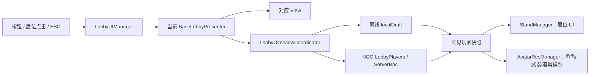

# LobbyScene UI 架构与脚本阅读顺序

## 1. 文档范围

本文记录当前 `LobbyScene` 的 UI 状态机、3D 展位、玩家模型、装备选择、Setting 和 NGO 大厅数据之间的职责边界。

当前大厅有三个正式 UI 状态：

- `Overview`：根状态。展示玩家展位、房间操作、准备状态、装备入口和 Setting 入口。
- `ItemSelect`：皮肤、武器、道具的可编辑或只读查看状态。
- `Setting`：World Space 设置界面，通过左侧分类按钮切换内容 Panel。

`Overview` 是返回导航的根节点。按下 ESC 时，由 `LobbyUIManager` 把返回请求交给当前 Presenter：

- `Overview`：不处理，不再向上返回。
- `ItemSelect`：复用确认按钮的退出逻辑，返回 `Overview`。
- `Setting`：复用返回按钮逻辑，保存后返回 `Overview`。
- `Setting` 正在等待改键时：第一次 ESC 只取消改键，下一次 ESC 才退出 Setting。

## 2. 总体运行关系



状态切换关系：

```text
Overview --装备槽或展位点击--> ItemSelect
Overview --设置按钮----------> Setting
ItemSelect --确认按钮或 ESC---> Overview
Setting --返回按钮或 ESC------> Overview
```

状态切换时，`LobbyUIManager` 先让旧 Presenter `Sleep()`，再让新 Presenter `WakeUp()`；Presenter 基类同步处理 `CanvasGroup` 与 Cinemachine 虚拟相机优先级。进入 `ItemSelect` 和返回 `Overview` 时，二维 UI 可按配置延迟到运镜完成后出现。

## 3. 推荐阅读顺序

建议按下面顺序阅读。先理解状态和唯一数据源，再进入各页面细节，能避免把 View、网络数据和模型加载混在一起看。

1. `LobbyScreenState.cs`：大厅三个页面状态的定义。
2. `BaseLobbyPresenter.cs`：所有页面共同的唤醒、休眠、CanvasGroup、虚拟相机和返回请求协议。
3. `LobbyUIManager.cs`：大厅 UI 总入口；状态切换、ESC、运镜延迟、展位点击入口都从这里开始。
4. `LobbyStandLayout.cs`：场景展位数组的唯一布局定义；展位 UI、模型生成点和相机锚点都从这里取。
5. `LobbyOverviewCoordinator.cs`：离线草稿与 NGO 权威数据之间的切换，以及同一快照如何同时驱动 UI 和模型。
6. `StandManager.cs` → `StandView.cs` → `StandClickHandler.cs`：展位显示、改名、BoxCollider 点击和悬停事件链。
7. `AvatarResManager.cs` → `CharacterSocketProvider.cs`：角色、武器、道具的 Addressables 生命周期、挂点和武器姿势动画。
8. `OverviewPresenter.cs` → `OverviewView.cs` → `JoinGameView.cs`：Overview 的准备、Host/Client、装备与 Setting 入口。
9. `ItemSelectPresenter.cs` → `ItemSelectView.cs` → `ItemSlotView.cs`：分类目录、只读规则、选择提交、完整刷新和图标加载。
10. `SettingPresenter.cs` → `SettingView.cs` → `SettingPanelTabView.cs`：Setting 的页面编排、按钮与 Panel 映射、返回逻辑。
11. `AudioSettingService.cs`、`InputRebindService.cs`、`SettingSaveService.cs`：设置数据的应用、改键和本地持久化。
12. `LobbyCameraMouseSwayExtension.cs`：最终镜头输出上的鼠标轻微跟随效果。

## 4. 核心编排脚本

| 脚本 | 主要职责 | 不应承担的职责 |
| --- | --- | --- |
| `LobbyScreenState.cs` | 定义页面状态 | 页面行为与数据处理 |
| `BaseLobbyPresenter.cs` | 页面生命周期、CanvasGroup、虚拟相机、返回协议 | 具体页面业务 |
| `LobbyUIManager.cs` | Presenter 注册、页面切换、ESC、UI 延迟、展位进入 ItemSelect | 直接渲染具体控件或加载模型 |
| `LobbyCameraMouseSwayExtension.cs` | 在 Cinemachine Finalize 阶段叠加鼠标晃动 | 修改虚拟相机锚点或页面状态 |
| `ItemCategory.cs` | 皮肤、武器、道具分类枚举 | 配置读取 |
| `ItemSlotData.cs` | ItemSelect 使用的统一显示数据 | 保存玩家权威状态 |

### 返回键扩展约定

`LobbyUIManager.Update()` 只读取 ESC，并调用 `TryNavigateBack()`。具体页面通过覆写 `BaseLobbyPresenter.TryHandleBackRequest()` 决定行为。

新增页面时：

1. 在 `LobbyScreenState` 添加状态。
2. 新 Presenter 继承 `BaseLobbyPresenter`，实现 `RenderView()`。
3. 如果该页面可以返回，覆写 `TryHandleBackRequest()`，并复用页面已有返回按钮所调用的业务方法。
4. 把 Presenter 加入 `LobbyUIManager._presenters`。
5. 不要在 `LobbyUIManager` 中为具体页面复制保存、确认或取消逻辑。

## 5. Overview 与网络房间功能

| 脚本 | 主要职责 |
| --- | --- |
| `OverviewUI/OverviewPresenter.cs` | Overview 业务入口；准备/开始、Host、Client、断开、连接超时、倒计时、装备入口、Setting 入口 |
| `OverviewUI/OverviewView.cs` | Overview 固定按钮和装备槽的事件转发、按钮文本与颜色刷新 |
| `OverviewUI/JoinGameView.cs` | 加入房间浮层、IP 输入、创建/加入按钮及 DOTween 显隐 |
| `OverviewUI/EquipmentSlotView.cs` | 单个装备入口的悬停、点击和槽位索引上报 |
| `OverviewUI/MainActionButtonView.cs` | 大厅通用按钮的指针事件、缩放反馈与可选高亮 |

`OverviewPresenter` 当前同时包含页面编排和 NGO 房间连接流程，是 UI 目录中职责最密集的脚本。功能稳定后若继续重构，优先把 Host/Client/超时处理拆为独立的房间连接控制器，Presenter 只保留 View 事件编排。

## 6. 展位、玩家数据与模型

### 唯一数据流

`LobbyOverviewCoordinator` 是大厅展示数据的编排入口：

- 未连接 NGO：使用 `_localDraft`，默认放在 0 号展位。
- 已连接 NGO：使用 `LobbyNetworkManager.LobbyPlayers` 的权威快照，并按服务器分配的 `StandIndex` 排列。
- 玩家修改皮肤、武器、道具或名字时：离线直接修改草稿；在线发送对应 ServerRpc。
- 每次快照刷新时，同一份 `_visibleStates` 同时传给 `StandManager` 和 `AvatarResManager`，避免 UI 与模型使用不同来源。

### 脚本职责

| 脚本 | 主要职责 |
| --- | --- |
| `LobbyWorld/LobbyStandLayout.cs` | 保存 `_stands`；提供玩家生成点和相机锚点，是场景布局唯一来源 |
| `LobbyWorld/LobbyOverviewCoordinator.cs` | 本地/网络数据源选择、默认玩家、资料提交、快照渲染 |
| `LobbyWorld/StandManager.cs` | 展位 UI 状态与交互开关；不持有权威玩家数据 |
| `LobbyWorld/StandView.cs` | 单个 Stand 的名字、准备文本、空位 UI、内联改名和 Billboard |
| `LobbyWorld/StandClickHandler.cs` | 把 Stand 预制件 `ClickCollider` 的点击与悬停转发给 `StandManager` |
| `LobbyWorld/AvatarResManager.cs` | 每个展位角色/武器/道具的 Addressables 加载、替换、过期请求和释放 |
| `LobbyWorld/Character/CharacterSocketProvider.cs` | 角色装备挂点；设置 Animator 的 `EquipmentPose` 并触发装备状态 |
| `LobbyWorld/Character/WeaponVisualPoints.cs` | 武器预制件上的副手与枪口标记；当前大厅尚未消费这些标记 |

`LobbyStandLayout._stands` 是场景展位数组；`AvatarResManager._stations` 只是与数组等长的运行时资源状态，两者不是重复的场景配置。

## 7. ItemSelect 功能

| 脚本 | 主要职责 |
| --- | --- |
| `WeaponChoseUI/ItemSelectPresenter.cs` | 从生成配置构建分类目录；维护当前分类、选择和只读玩家；向 Coordinator 提交本地修改 |
| `WeaponChoseUI/ItemSelectView.cs` | Tab、信息面板、确认按钮和 ItemSlot 对象池 |
| `WeaponChoseUI/ItemSlotView.cs` | 单格名字、完整高亮状态、点击反馈，以及按 Config 图标路径异步加载 Addressable Sprite |
| `ItemCategory.cs` | 分类枚举 |
| `ItemSlotData.cs` | 三类配置统一到 UI 的数据结构 |
| `WeaponChoseUI/WeaponInfo.cs` | 旧的武器信息数据载体；当前 LobbyScene 流程未引用 |

关键规则：

- `EnterWithCategory` 用于本地玩家，可修改装备。
- `EnterAsReadonly` 用于其他玩家，只显示该玩家当前分类的已装备信息，不允许提交修改。
- 切换 Tab 必须走 `FullRefreshUI()`，同步刷新 Tab 高亮、信息面板、格子和当前选择高亮。
- 装备变更立即提交到 `LobbyOverviewCoordinator`；确认按钮只负责退出到 `Overview`。

## 8. Setting 功能

### UI 层

| 脚本 | 主要职责 |
| --- | --- |
| `SettingsUI/SettingPresenter.cs` | 加载、应用、保存设置；协调音量、改键、恢复默认和返回 |
| `SettingsUI/SettingView.cs` | 汇总 Setting 子视图和按钮事件 |
| `SettingsUI/SettingPanelTabView.cs` | 通用“按钮 → Panel”映射；保证只激活一个内容 Panel 并同步按钮高亮 |
| `SettingsUI/AudioSettingView.cs` | 三个音量 Slider、百分比和交互锁定 |
| `SettingsUI/InputBindingSettingView.cs` | 管理固定按键行集合 |
| `SettingsUI/InputBindingRowView.cs` | 单行行为名称、当前按键和更改按钮 |
| `SettingsUI/RebindOverlayView.cs` | 改键等待提示及输入遮罩 |

新增 Setting 分类时，只需在场景中增加按钮和 Panel，并在 `SettingPanelTabView._tabs` 增加映射。通用 Tab 脚本不应依赖音频或按键设置类型。

### 数据与服务层

| 脚本 | 主要职责 |
| --- | --- |
| `Settings/GameUserSettingsData.cs` | 可序列化设置数据、默认值和范围归一化 |
| `Settings/SettingSaveService.cs` | `user_settings.json` 的读取、容错和保存 |
| `Settings/AudioSettingService.cs` | 把线性音量转换为 dB 并写入 AudioMixer 参数 |
| `Settings/InputBindingDefinition.cs` | Setting 当前展示的动作与 Binding 目录 |
| `Settings/InputRebindService.cs` | Input System 交互式改键、Override JSON、取消和恢复默认 |

当前 `Setting` 的 `InputActionAsset` 与 Gameplay 输入读取保持隔离。这是重构阶段的明确约束；后续 Gameplay 输入系统统一时，再决定共享 Action Asset 或通过输入服务注入 Override。

## 9. 场景绑定检查顺序

排查 LobbyScene 问题时，建议按以下顺序检查 Inspector：

1. `LobbyUIManager._presenters` 是否包含 `Overview`、`ItemSelect`、`Setting`，且各 Presenter 的 `_associatedState` 唯一。
2. 每个 Presenter 是否绑定自己的虚拟相机；`LobbyUIManager._cinemachineBrain` 是否指向 Main Camera 上的 Brain。
3. `LobbyStandLayout._stands` 数量、顺序是否与 Stand 预制件和服务器 `StandIndex` 一致。
4. `LobbyOverviewCoordinator` 是否绑定 Layout、StandManager、AvatarResManager、LobbyNetworkManager。
5. 每个 `StandView` 是否绑定 PlayerSpawnPos、CameraFocusPos、Player UI、Empty UI 和 ClickCollider。
6. 角色预制件是否包含 `Animator` 与 `CharacterSocketProvider`，挂点数组顺序是否符合 `EquipmentSlot`。
7. 皮肤、武器、道具 Config 中的模型与图标地址是否已注册到 Addressables。
8. `SettingUI` 保持 World Space；Canvas 的 Event Camera、Setting Presenter、分类按钮与 Panel 映射是否完整。

这些 Inspector 必填引用在代码中按“应当存在”处理，不使用静默空值兜底，以便场景漏绑时立即暴露。只在 Unity/NGO 销毁顺序、异步句柄和可选视觉项等真正允许缺失的边界做保护。

## 10. 当前审查结论与后续边界

本轮已经完成：

- 所有大厅状态共用一个 ESC 入口，具体返回行为留在各 Presenter。
- Overview 明确为导航根状态。
- Setting 改键取消与页面返回之间增加同帧隔离。
- NGO 和大厅网络对象的事件退订改为使用缓存订阅源，避免退出 Play Mode 时因单例销毁顺序产生异常。
- UI 目录内现有方法均补有简短功能注释。
- Setting 使用可扩展的按钮与 Panel 映射，World Space 根节点不参与页面内部切换。

暂不在本轮扩大处理：

- 不修改 Gameplay 输入获取代码。
- `WeaponVisualPoints` 暂时只是武器预制件标记，待射击展示或 IK 接入时再消费。
- `WeaponInfo` 当前未被 LobbyScene 使用；Gameplay 配置重构时可删除或迁移，当前保留以避免越过本轮范围。
- `OverviewPresenter` 可在下一阶段拆分网络房间控制器，但当前功能链路保持不变。
