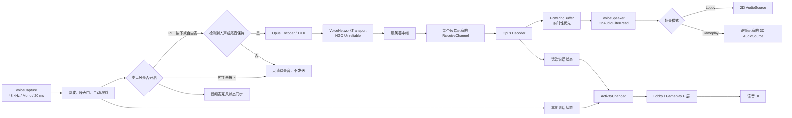

# 全局语音系统说明与复盘

> 最后审查：2026-09-25  
> 适用目录：`Assets/_HotUpdate/Scripts/Voice`  
> 当前定位：面向 Lobby 与 Gameplay 的轻量全局语音系统，优先实时性，不追求复杂的语音中间件能力。

## 1. 当前结论

当前系统已经具备以下完整链路：

- 玩家连接后自动启动麦克风采集。
- 支持按键说话与自由麦两种模式。
- 使用 Opus 编解码和 NGO Named Message 传输。
- Lobby 使用无距离衰减的 2D 播放。
- Gameplay 跟随玩家 Transform 使用 AudioSource 3D 衰减。
- 闭麦、开麦未说话、正在说话三种 UI 状态由对应 P 层驱动。
- 已加入基础高低通、噪声门和自动增益。
- 已采用“最新语音优先”的低延迟策略，避免补播数秒前的旧语音。
- 已开启 Opus DTX，并在发送层跳过静音帧；自由麦未说话时只同步低频状态，不发送音频包。
- 主要 PCM、Opus 和音频线程缓冲均复用数组，设计上没有主动制造逐帧托管垃圾。

但是，本次 Play Mode 审查发现一个 **P0 运行时阻塞问题**：

```text
MissingMethodException:
Method not found:
Concentus.IOpusEncoder.Encode(ReadOnlySpan<float>, int, Span<byte>, int)
```

Unity 编译检查仍然是 0 错误、0 警告，因此这个问题只能通过实际进入 Play Mode 或构建包测试发现。当前进程同时存在多个 `System.Memory`/`ReadOnlySpan<T>` 类型来源，Concentus 2.2.2 的 Span 接口在编译期和运行期发生了类型绑定冲突。

建议下一步首先把 [VoiceOpusEncoder.cs](./VoiceOpusEncoder.cs) 改为使用 `Concentus.Structs.OpusEncoder` 和 `Concentus.Structs.OpusDecoder` 的数组重载，绕开 Span 接口。数组重载已在本次审查中执行 1000 次编码和 1000 次解码，结果均为 `0 B` 托管分配。

## 2. 系统结构



### 2.1 文件职责

| 文件 | 职责 |
| --- | --- |
| [VoiceManager.cs](./VoiceManager.cs) | 系统入口、网络生命周期、发送模式、状态事件、远端通道和 2D/3D 切换 |
| [VoiceCapture.cs](./VoiceCapture.cs) | 麦克风采集、输入滤波、噪声门、自动增益、采集积压裁剪 |
| [VoiceOpusEncoder.cs](./VoiceOpusEncoder.cs) | Opus 编码器与解码器包装 |
| [Network/VoiceNetworkTransport.cs](./Network/VoiceNetworkTransport.cs) | NGO 音频包与麦克风状态消息的客户端上行、服务器中继 |
| [PCMRingBuffer.cs](./PCMRingBuffer.cs) | 主线程写入、音频线程读取的单写单读 PCM 环形缓冲 |
| [VoiceSpeaker.cs](./VoiceSpeaker.cs) | 每个远端玩家的 AudioSource、实时播放和 2D/3D 空间模式 |
| [HotFix.Voice.asmdef](./HotFix.Voice.asmdef) | 语音程序集及其 NGO、Input System、设置、Concentus 依赖 |

## 3. 生命周期和数据流

### 3.1 启动

1. `NetworkBootstrap` 上同时存在 `NetworkManager`、`VoiceCapture` 和 `VoiceManager`。
2. `VoiceManager.Awake` 注册 NGO 生命周期事件，并读取本地语音设置。
3. 本地客户端连接成功后创建 Opus Encoder，并调用 `VoiceCapture.StartCapture()`。
4. 麦克风设备名为空时，Unity 使用系统默认输入设备。

当前预制件：

- [NetworkBootstrap.prefab](../../Prefabs/Network/NetworkBootstrap.prefab)
- 默认按键：`V`
- Gameplay 3D 最小距离：`2 m`
- Gameplay 3D 最大距离：`18 m`

### 3.2 采集与发送

麦克风固定以 48 kHz、单声道、20 ms 一帧采集，每帧为 960 个浮点样本。

输入处理顺序：

1. 80 Hz 高通，削减低频轰鸣和直流偏移。
2. 10 kHz 低通，削减部分高频嘶声。
3. 噪声门，默认阈值 `0.006 RMS`。
4. 约 180 ms 的噪声门保持，避免截断词尾。
5. 自动增益，目标 `0.08 RMS`，最大增益 6 倍。
6. 输出限制在 `[-0.95, 0.95]`，避免明显削波溢出。

发送模式：

- `PushToTalk`：仅在按住 `V` 时编码和发送。
- `OpenMicrophone`：麦克风持续保持开启，但只有检测到人声或 120 ms 尾音保持期间才编码、发送。
- PTT 未按下时仍持续消费麦克风数据，避免下次按键补发旧录音。
- Opus DTX 已开启，作为编码层的第二道静音带宽保护。
- 麦克风开关状态独立同步：状态变化立即发送；开麦期间每 1 秒发送一次心跳，使自由麦静音时远端 UI 仍保持灰色。

### 3.3 实时性策略

游戏语音以“新鲜度高于完整性”为原则：

- 采集轮询停顿超过 250 ms，或积压超过 60 ms 时，只保留最新约 40 ms。
- 接收端初次播放预缓冲约 60 ms。
- 接收端积压超过 200 ms 时，丢弃旧样本并回落到约 100 ms。
- 网络使用 `NetworkDelivery.Unreliable`，不重传已经过期的语音。
- `OnAudioFilterRead` 直接从环形缓冲读取，避免流式 AudioClip 的预取等待。

测试记录：

- 旧流式 PCM 回调从 `Play()` 到消费缓冲约 430 ms。
- 改用 `OnAudioFilterRead` 后，同一无声探针约 52 ms。
- 模拟 500 ms 主线程卡顿时，采集端丢弃了 440 ms 旧录音，仅保留最新部分。

### 3.4 网络

数据路径：

```text
音频：普通客户端 -> VoiceC2S -> 服务器 -> VoiceS2C -> 其他客户端
状态：普通客户端 -> VoiceStateC2S -> 服务器 -> VoiceStateS2C -> 其他客户端
Host 本地语音 -> 服务器进程直接中继 -> 远端客户端
远端客户端 -> Host 时，Host 在服务器进程内直接消费一份
```

每包包含：

- `ushort sequence`
- 服务端下行时额外包含 `ulong speakerClientId`
- Opus 数据

音频消息使用 `Unreliable`，避免重传过期语音。状态消息只包含一个开关字节，服务端下行时附带 `speakerClientId`，使用 `ReliableSequenced`。远端开麦心跳超过 3 秒未到达时自动转为关闭，防止异常断流后 UI 一直显示。

接收端使用 `ushort` 差值处理音频序号回绕，并丢弃重复包和乱序旧包。当前没有丢包补偿、FEC 或自适应抖动缓冲。

### 3.5 播放和空间音效

每个首次收到语音的远端玩家会懒创建一个 `VoiceSpeaker`：

- 一个 Opus Decoder。
- 一个 500 ms 容量的 PCM 环形缓冲。
- 一个运行时 AudioSource。
- 一个普通静音 AudioClip，作为 AudioSource 的播放时钟。
- 一个音频线程复用缓冲。

Lobby 不绑定玩家 Transform，因此 `spatialBlend = 0`。Gameplay 通过 [PlayerManager.cs](../GameProcess/Player/PlayerManager.cs) 按 `ClientId` 绑定玩家 Transform，因此 `spatialBlend = 1`，并跟随对应玩家位置。

本地玩家不会播放自己的网络语音，避免直接回声。

### 3.6 状态和 UI

语音状态定义：

| 状态 | 含义 | UI |
| --- | --- | --- |
| `Closed` | PTT 未按下、远端超时或玩家断开 | 隐藏 |
| `Open` | 麦克风处于发送状态但未检测到人声 | 灰色 |
| `Speaking` | RMS 超过说话阈值 | 高亮 |

状态通过 `VoiceManager.ActivityChanged` 发布。

- Lobby 由 [LobbyOverviewCoordinator.cs](../UI/LobbyWorld/LobbyOverviewCoordinator.cs) 转换并驱动 Stand View。
- Gameplay 由 [GameplayHUDPresenter.cs](../UI/GameplayUI/HUD/GameplayHUDPresenter.cs) 转换并驱动对应玩家状态栏。
- 设置界面通过 [SettingPresenter.cs](../UI/LobbyUI/SettingsUI/SettingPresenter.cs) 切换 PTT/自由麦并立即应用。

## 4. GC 与性能查验

### 4.1 测试结果

| 测试项 | 条件 | 结果 |
| --- | --- | --- |
| Concentus 具体类型数组编码 | 预热后循环 1000 次 | `0 B` |
| Concentus 具体类型数组解码 | 预热后循环 1000 次 | `0 B` |
| `VoiceCapture.TryReadFrame` | 实际麦克风成功读取 51 帧 | `0 B` |
| `VoiceNetworkTransport.SendVoice` | Host、无远端，循环 1000 次 | `0 B` 托管分配 |
| 无语音帧的 `VoiceManager.Update` | Unity Profiler | `0 B` |
| 自由麦静音发送抑制 | 强制静音判定，运行 3.5 秒 | 发送序号保持 `0`，状态为 `Open` |
| 当前异常状态下的编码帧 | 每帧抛 `MissingMethodException` | 约 `0.5 KB/次` |

当前 Opus 为 20 ms 一包，即每秒最多约 50 次编码。异常状态会产生约 `25 KB/s` 托管垃圾，并伴随高频异常堆栈和 Console 输出；这不是正常发送路径的分配，而是程序集冲突导致的异常成本。

### 4.2 当前无逐帧分配的设计点

- 采集帧、编码包、解码帧均在会话或通道创建时一次性分配。
- `ProcessInput` 原地修改 PCM 数组。
- `Span`/数组切片本身不应创建托管对象。
- `PcmRingBuffer` 使用固定数组与游标，不创建临时数组。
- `OnAudioFilterRead` 使用预分配音频线程缓冲。
- 字典遍历和事件调用本身没有主动创建临时集合。
- NGO `FastBufferWriter` 当前使用 `Allocator.Temp`，属于原生临时分配，不计入托管 GC，但仍有每包原生分配和释放成本。

### 4.3 GC 结论限制

当前完整双客户端 GC 验证尚不能判定为通过，原因是 Play Mode 的 Concentus Span 调用会先抛异常。必须先修复 P0 问题，然后重新检查：

1. 一台发送客户端持续说话 60 秒。
2. 一台接收客户端同时解码和 3D 播放。
3. Profiler 分别查看 Main Thread 与 Audio Thread。
4. 关闭 Deep Profile 后记录真实 `GC.Alloc`。
5. 在最终目标平台构建中复测，而不仅是 Editor。

## 5. 本次审查发现的问题

### P0：Concentus Span 运行时绑定失败

现象：

```text
MissingMethodException: Method not found:
int Concentus.IOpusEncoder.Encode(
    ReadOnlySpan<float>, int, Span<byte>, int)
```

证据：

- `Concentus.dll` 版本为 2.2.2。
- AppDomain 中同时出现 `System.Memory 4.0.99.0`、`System.Memory 4.0.1.1`，同时 Unity 的 `mscorlib` 也提供 Span 类型。
- 动态编译直接报告 `ReadOnlySpan<T>` 同时存在于 `System.Memory` 和 `mscorlib`。
- 反射能看到 Concentus 方法，但 HotFix.Voice 的直接接口调用仍无法绑定。
- 使用 `Concentus.Structs.OpusEncoder/Decoder` 的数组重载可正常运行，并且 1000 次调用均为 `0 B`。

建议修复：

```csharp
// 编码
encoder.Encode(
    pcm, 0, frameSamples,
    output, 0, output.Length);

// 解码
decoder.Decode(
    opusData, 0, opusLength,
    pcmOutput, 0, frameSamples,
    false);
```

这是当前最高优先级，修复前不能认为语音发送链路稳定可用。

### 已处理 P1：自由麦静音时持续发送

已将麦克风开关状态与音频包拆开：

- Opus `UseDTX = true`。
- 静音时发送层不调用编码器、不发送音频包。
- 状态变化立即可靠同步；自由麦开启期间每 1 秒发送一个状态心跳。
- 检测到人声后保留 120 ms 音频尾部，降低词尾被切断的概率。

这会显著减少自由麦静音时的客户端上行和服务端广播量。多人同时说话时，音频中继仍接近 `O(N²)`，后续可通过频道或距离过滤继续降低带宽。

### P1：运行时 VoiceSpeaker 永久工作

每个远端玩家第一次发送语音后，AudioSource 会一直循环，`OnAudioFilterRead` 也会持续执行，即使该玩家之后长期闭麦。这不会产生托管 GC，但会持续消耗音频线程时间。

建议在一定时间没有语音包且缓冲为空后停止 AudioSource；新语音到达时重新预缓冲并播放。

### P1：语音没有接入 AudioMixer

运行时创建的 AudioSource 没有设置 `outputAudioMixerGroup`。当前 Master/SFX 设置通过 AudioMixer 参数实现，因此语音可能绕过现有音量设置。

建议增加独立的 Voice Mixer Group 和 Voice Volume，或至少明确路由到 Master/SFX 下的合适分组。

### P1：完整 GC 结论被运行时异常阻断

正常组件微基准为 0 B，但在修复 Concentus 之前，完整发送链路会被异常分配污染。修复后必须重新做双客户端 Profiler 验证。

### P2：丢包只会形成空洞

序号可以发现乱序和重复，但没有对缺失序号执行 Opus PLC，也没有启用 In-band FEC。弱网下会出现断音或爆音。

建议先增加无额外网络等待的 PLC；只有在确实需要时，再考虑以约 20 ms 额外延迟换取 FEC。

### P2：固定抖动缓冲

当前 60 ms 预缓冲和 200 ms 硬上限简单可靠，但无法根据实际网络抖动变化。网络稳定时可能略保守，网络波动时又可能频繁欠载。

未来可以统计包到达间隔，在 40～150 ms 内动态调整目标缓冲，同时保持 200 ms 左右硬上限。

### P2：简单音频预处理的上限

当前滤波、噪声门和自动增益能解决基础底噪与低电平问题，但不具备：

- 回声消除 AEC。
- 真正的宽带噪声抑制。
- 键盘声、风噪和持续背景人声识别。
- 不同麦克风自动标定。

自动增益过高时仍会把说话期间的硬件底噪一起放大。

### P2：设备与平台适配有限

- 没有麦克风选择 UI。
- 没有热插拔和设备丢失恢复。
- 只接受单声道输入，立体声设备会直接失败。
- 没有移动平台麦克风权限流程。
- 没有在采集失败后自动重试。

### P2：每个玩家重复创建静音 Clip

当前每个 VoiceSpeaker 都创建一个 1 秒、48 kHz、单声道静音 Clip。粗略计算每份 PCM 约 187.5 KiB；再加 500 ms 环形缓冲约 93.75 KiB，每个远端玩家至少约 281 KiB，不包含 Decoder、AudioSource 和 Unity 对象开销。

静音播放时钟 Clip 可以共享，能明显降低多人房间的固定内存。

### P2：3D 音频仍需专项听感验证

`OnAudioFilterRead` 会把单声道样本写入回调提供的所有通道，当前依赖 AudioSource 后续空间化处理。需要在 Gameplay 中验证左右定位、距离衰减、遮挡场景和多个玩家同时说话时的听感。

### P3：生命周期依赖可以更一致

Lobby 使用 `VoiceManager.InstanceChanged` 处理实例变化，Gameplay HUD 直接订阅 `VoiceManager.Instance`。当前 NetworkBootstrap 全局常驻时没有问题，但如果未来支持重建网络根节点，Gameplay HUD 可能订阅旧实例或初始化时遇到空实例。

## 6. 已遇到的问题和经验

### 6.1 耳麦人声小、底噪明显

原因：最初将原始麦克风 PCM 直接交给 Opus，没有输入整形。低电平耳麦的人声和底噪比例没有改善。

处理：加入高通、低通、噪声门、保持时间和受限自动增益。

经验：自动增益只能提高电平，不能改善硬件本身的信噪比；必须先做噪声门/滤波，并限制最大增益。

### 6.2 本地语音延迟达到 2～3 秒

原因：

- 发送端会在卡顿后补发最长接近 2 秒的旧麦克风数据。
- 接收端原本允许 PCM 排队接近 2 秒。
- 流式 AudioClip 存在额外预取等待。

处理：

- 采集端跳过旧帧。
- 接收端设置 200 ms 硬上限并回落到 100 ms。
- 使用 `OnAudioFilterRead` 直接消费 PCM。

经验：实时游戏语音必须优先时效性。短暂缺字通常比完整播放数秒前的语音更可接受。

### 6.3 编译成功不代表运行时兼容

本次 Concentus 问题在脚本编译阶段完全正常，但 Play Mode 调用 Span 接口时失败。

经验：第三方 DLL，尤其是使用 `Span<T>`、`System.Memory`、AOT 或 HybridCLR 的库，必须至少覆盖以下测试：

- Editor Play Mode。
- Mono 构建。
- IL2CPP 构建。
- HybridCLR 热更新实际加载路径。
- 编码、解码方法的真实调用，而不只是类型加载或反射检查。

### 6.4 GC 数据必须先排除异常日志

Profiler 最初显示 `VoiceManager.Update` 每个语音帧约 0.5 KiB 分配。进一步检查发现分配来自高频 `MissingMethodException` 和堆栈日志，不是 Opus 或 PCM 正常热路径。

经验：看到 GC.Alloc 后应先确认该帧是否有异常、日志、Profiler 自身开销，再判断是否需要池化业务对象。

## 7. 推荐优化顺序

1. **修复 Concentus Span 绑定问题**，改用具体类型的数组重载。
2. 进行双客户端发送、接收和断线重连回归测试。
3. 关闭 Deep Profile，重新测量 Main Thread、Audio Thread 和 GC。
4. 将 VoiceSpeaker 路由到独立 AudioMixer Group，并增加语音音量设置。
5. 长时间无包时暂停 VoiceSpeaker，并共享静音播放时钟 Clip。
6. 增加 PLC、弱网统计和简单自适应抖动缓冲。
7. 增加设备选择、热插拔、权限和采集重试。
8. 根据项目规模再决定是否接入 WebRTC AEC/NS 或专业语音 SDK。

## 8. 可扩展方向

- 玩家单独静音、音量调节、举报和黑名单。
- 队伍频道、附近频道、全局频道、观战频道。
- 服务器按房间/队伍过滤转发，降低带宽。
- 独立的 Voice Mixer Group、压缩器和限制器。
- 麦克风设备下拉列表和输入电平测试页。
- AEC、NS、VAD 和设备自动校准。
- Opus PLC、FEC 和丢包率动态参数。
- 服务端包速率限制、最大有效 Opus 包长度和滥用保护。
- 语音质量、延迟、丢包、裁剪帧数、缓冲长度的运行时诊断面板。
- 录制最近数秒语音用于举报时，需要先确认隐私、合规和用户授权。

## 9. 回归测试清单

### 基础功能

- PTT 未按下时不发送，UI 隐藏。
- PTT 按下未说话时 UI 灰色。
- PTT 说话时 UI 高亮。
- 自由麦未说话时远端 UI 保持灰色。
- 自由麦静音时发送序号不增长，网络中没有音频包。
- 自由麦说话时 UI 高亮。
- 新加入客户端在最多约 1 秒内收到其他自由麦玩家的开麦状态。
- 开麦状态心跳中断超过 3 秒后，远端 UI 自动隐藏。
- 断线后麦克风、Encoder、Decoder 和 Speaker 正确释放。

### 场景切换

- Lobby 中所有语音为 2D，不受玩家距离影响。
- 进入 Gameplay 后远端语音绑定正确玩家并启用 3D。
- 返回 Lobby 后清除 Gameplay Anchor，恢复 2D。
- 玩家重连或对象替换时不会继续跟随旧 Transform。

### 延迟和弱网

- 正常局域网端到端延迟保持在可交流范围。
- 主线程卡顿 500 ms 后不会补播旧语音。
- 接收缓存不会持续超过 200 ms。
- 乱序旧包被丢弃。
- 丢包时允许轻微断音，但不能累积延迟。

### 音质

- 轻声不会被噪声门过度截断。
- 环境静音时没有明显持续底噪。
- 大声说话不会频繁削波。
- Gameplay 3D 左右定位和距离衰减正确。
- 多名玩家同时说话时没有明显爆音或严重主线程峰值。

### 性能与兼容

- Play Mode 不出现 Concentus `MissingMethodException`。
- 发送和接收稳定运行 60 秒，语音热路径无持续 GC.Alloc。
- Audio Thread 无超时和红色 DSP 指示。
- Mono、IL2CPP、HybridCLR 目标环境均实际调用编解码方法。
- 4～8 名玩家自由麦场景检查带宽、CPU、内存和服务端转发量。

## 10. 参数调节建议

| 参数 | 当前值 | 调节方向 |
| --- | ---: | --- |
| 高通频率 | 80 Hz | 低频轰鸣明显时升高；声音变薄时降低 |
| 低通频率 | 10 kHz | 高频嘶声明显时降低；清晰度不足时升高 |
| 噪声门阈值 | 0.006 RMS | 底噪触发时升高；轻声被截断时降低 |
| 目标人声电平 | 0.08 RMS | 整体偏小时提高，注意削波和底噪 |
| 最大自动增益 | 6 倍 | 硬件输入过低时提高，但不建议长期超过 6 |
| 说话保持 | 120 ms | UI 闪烁时提高；状态拖尾明显时降低 |
| 开麦状态心跳 | 1 s | 更低可加快晚加入者同步，但会增加控制消息 |
| 远端状态超时 | 3 s | 应明显大于心跳周期，避免正常波动导致图标消失 |
| 初始播放预缓冲 | 60 ms | 断音多时提高；首音延迟高时降低 |
| 接收积压硬上限 | 200 ms | 实时性优先时保持较低，不建议提高到秒级 |
| 接收裁剪目标 | 100 ms | 网络稳定时可继续降低 |

---

本系统当前适合小规模、可信客户端、低复杂度的游戏内语音。自由麦静音流量已经消除；继续扩展时，应优先解决运行时编解码兼容、多人同时说话时的带宽增长、AudioMixer 路由和完整弱网验证，再考虑更复杂的语音处理算法。
